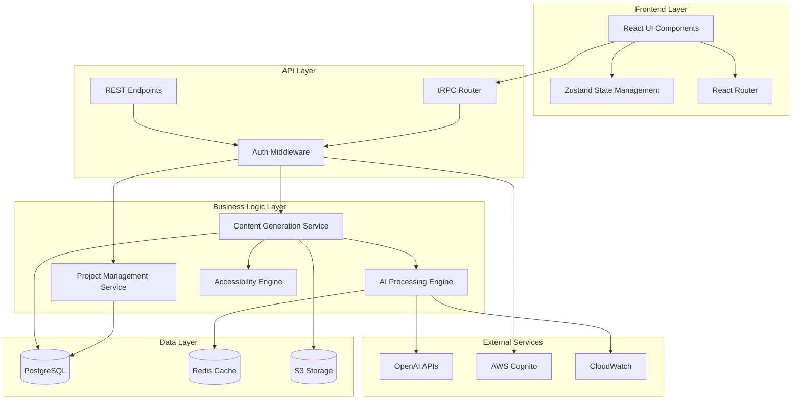
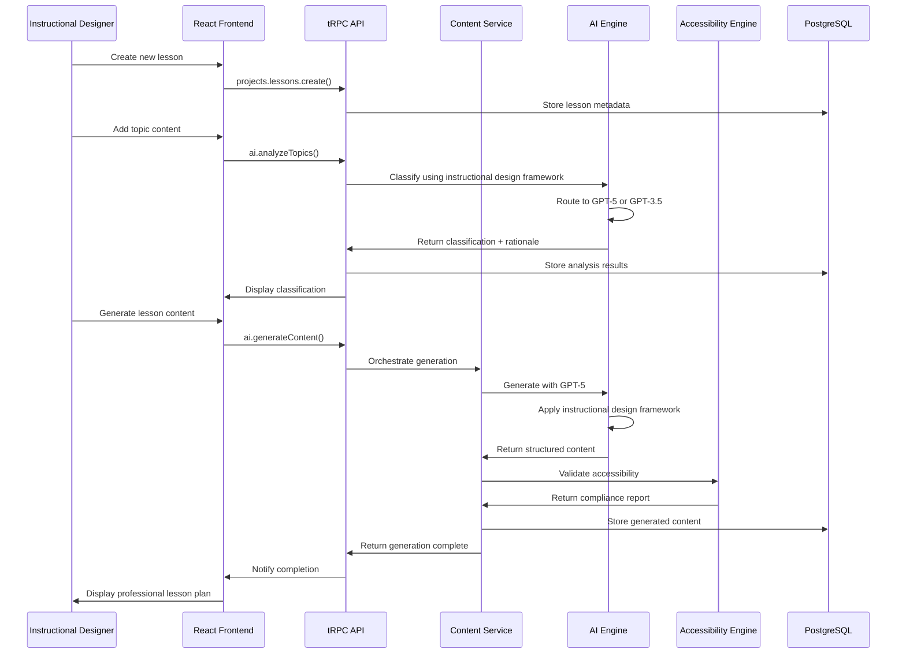
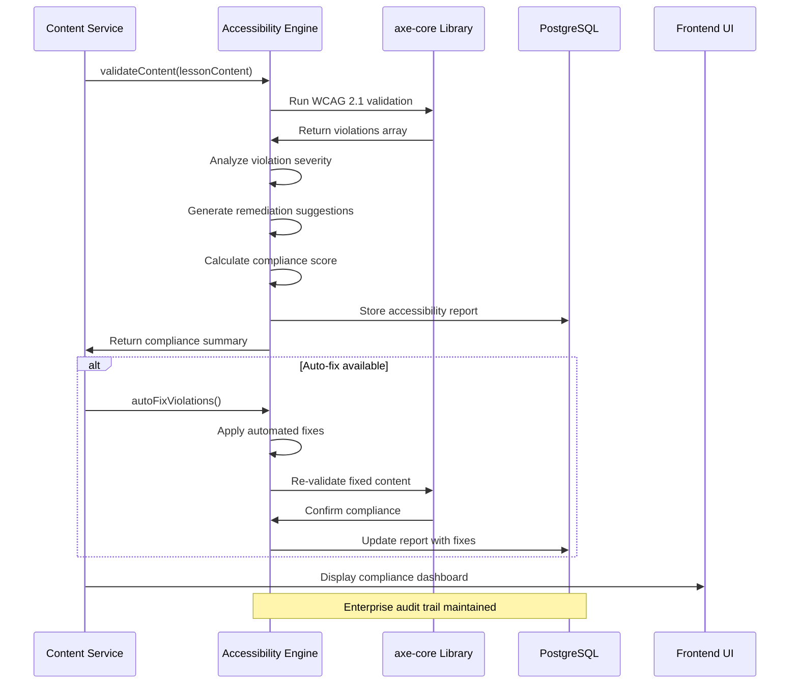
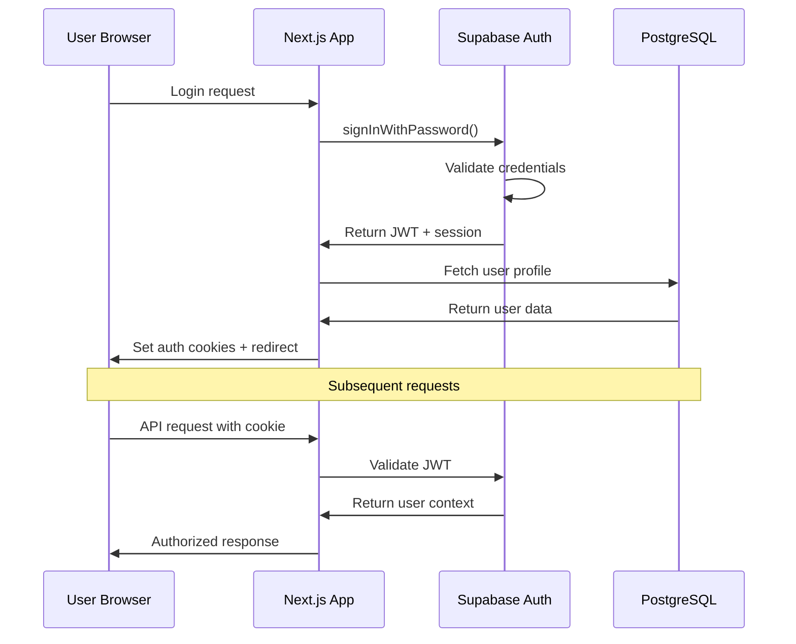
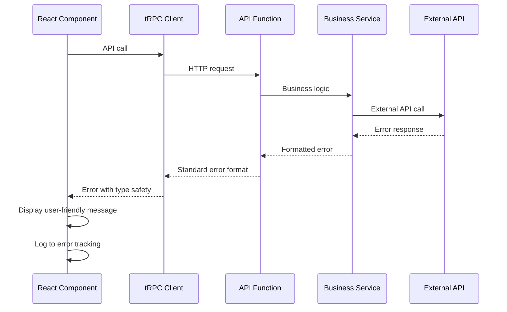

# Instructly Fullstack Architecture Document

## Introduction

This document outlines the complete fullstack architecture for **Instructly**, including backend systems, frontend implementation, and their integration. It serves as the single source of truth for AI-driven development, ensuring consistency across the entire technology stack.

This unified approach combines what would traditionally be separate backend and frontend architecture documents, streamlining the development process for modern fullstack applications where these concerns are increasingly intertwined.

### Starter Template or Existing Project

Based on the PRD analysis, this appears to be a **greenfield project** with specific technology preferences outlined:

- **Frontend**: React with TypeScript for accessibility support (WCAG AA compliance)
- **Backend**: Node.js with Express/Fastify for AI integration
- **Platform**: AWS preferred for enterprise SOC 2 compliance
- **Repository**: Monorepo approach specified for shared code and unified testing

**Decision**: N/A - Greenfield project with clear technical preferences from PRD

### Change Log

| Date | Version | Description | Author |
|------|---------|-------------|---------|
| 2025-08-17 | 1.0 | Initial architecture creation from comprehensive PRD | Winston (Architect) |
| 2025-08-17 | 1.1 | Updated AI strategy to GPT-5 primary with cost optimization | Winston (Architect) |

## High Level Architecture

### Technical Summary

Instructly employs a **cloud-native monorepo architecture** deployed on AWS, featuring a React TypeScript frontend with Node.js Express backend services. The system uses **microservices within monorepo** pattern, enabling shared code development while maintaining service independence for AI processing, accessibility compliance, and content generation. Key integration points include the **AI Processing Engine (GPT-5 primary with GPT-3.5 fallback and intelligent caching)**, real-time accessibility validation service, and enterprise authentication systems. This architecture achieves PRD goals through **enhanced cost-optimized AI integration (<30% revenue with improved economics)**, automated WCAG 2.1 compliance, and professional stakeholder interfaces that position instructional designers as credible experts rather than creative hobbyists.

### Platform and Infrastructure Choice

**Platform:** AWS Full Stack
**Key Services:** Lambda, API Gateway, RDS PostgreSQL, ElastiCache Redis, S3, CloudFront, Cognito, ECS Fargate
**Deployment Host and Regions:** us-east-1 (primary), us-west-2 (failover), eu-west-1 (EU compliance)

### Repository Structure

**Structure:** Monorepo with microservices
**Monorepo Tool:** Turborepo (optimal for TypeScript sharing and build caching)
**Package Organization:** Domain-driven packages with shared utilities, separate apps for web frontend and backend services

### High Level Architecture Diagram

```mermaid
graph TB
    User[👤 Instructional Designer] --> CDN[CloudFront CDN]
    CDN --> Frontend[React Frontend<br/>Vercel/S3]
    
    Frontend --> APIGateway[API Gateway<br/>Authentication & Rate Limiting]
    APIGateway --> AuthService[Cognito<br/>User Management]
    APIGateway --> CoreAPI[Core API<br/>Lambda/ECS]
    
    CoreAPI --> AIEngine[AI Processing Engine<br/>GPT-5 Primary + GPT-3.5 Fallback<br/>Intelligent Caching Strategy]
    CoreAPI --> AccessibilityEngine[Accessibility Engine<br/>WCAG Validation]
    CoreAPI --> ContentService[Content Generation<br/>Lesson Plans & Activities]
    
    CoreAPI --> Cache[Redis Cache<br/>AI Response Caching<br/>24hr TTL + Smart Invalidation]
    CoreAPI --> Database[(PostgreSQL<br/>User Data & Projects)]
    CoreAPI --> Storage[S3 Storage<br/>Generated Content)]
    
    AIEngine --> GPT5[OpenAI GPT-5 API<br/>$1.25/$10 per million tokens]
    AIEngine --> GPT3Fallback[GPT-3.5-turbo<br/>Simple Classifications]
    AccessibilityEngine --> ValidationLib[axe-core<br/>Accessibility Rules]
    
    CoreAPI --> Monitoring[CloudWatch<br/>Logs & Metrics<br/>AI Cost Tracking]
    Database --> Backup[RDS Backups<br/>Point-in-time Recovery]
```

### Architectural Patterns

- **Jamstack Architecture:** Static site generation with serverless APIs - _Rationale:_ Optimal performance and scalability for content-heavy applications with enterprise caching needs
- **Component-Based UI:** Reusable React components with TypeScript - _Rationale:_ Maintainability and type safety across large codebases, essential for accessibility compliance
- **Repository Pattern:** Abstract data access logic - _Rationale:_ Enables testing and future database migration flexibility for enterprise requirements
- **API Gateway Pattern:** Single entry point for all API calls - _Rationale:_ Centralized auth, rate limiting, and monitoring essential for enterprise security
- **Command Query Responsibility Segregation (CQRS):** Separate read/write operations for lesson plans - _Rationale:_ Optimizes performance for complex AI generation vs simple content retrieval
- **Circuit Breaker Pattern:** Resilient external API calls to OpenAI - _Rationale:_ Prevents cascade failures when AI services are unavailable, maintaining system reliability
- **Event-Driven Architecture:** Async processing for AI content generation - _Rationale:_ Enables responsive UI while handling long-running AI processing tasks
- **Intelligent AI Routing Pattern:** Route requests to optimal AI model based on complexity - _Rationale:_ GPT-5 for complex content generation, GPT-3.5 for simple classifications, maximizing quality while controlling costs

### AI Strategy Update (GPT-5 Integration)

**Primary Model:** GPT-5 at $1.25/$10 per million tokens
- Complex lesson plan generation
- instructional design framework analysis
- Professional documentation creation
- Accessibility content generation

**Fallback Model:** GPT-3.5-turbo for simple tasks
- Basic content classifications
- Quick validations
- Cache warming operations

**Cost Optimization Benefits:**
- 50% reduction in input token costs vs GPT-4o
- 45% fewer factual errors reducing regeneration needs
- Better instruction following reduces retry attempts
- Enhanced 400k context window reduces API calls for comprehensive analysis

**Quality Improvements for Instructional Design:**
- Significantly improved content generation quality
- Better adherence to instructional design frameworks
- Reduced hallucinations critical for professional credibility
- Enhanced instruction following for consistent instructional design framework classification

This updated AI strategy improves both cost economics and content quality, strengthening our competitive position while maintaining the <30% AI cost target.

## Tech Stack

This is the **DEFINITIVE technology selection** for the entire project. All development must use these exact versions and tools.

### Technology Stack Table

| Category | Technology | Version | Purpose | Rationale |
|----------|------------|---------|---------|-----------|
| Frontend Language | TypeScript | 5.3+ | Type-safe frontend development | Essential for AI integration reliability and shared types with backend |
| Frontend Framework | Next.js | 14.0+ | React framework with SSR/SSG | Professional performance, SEO for stakeholder sharing, Vercel optimization |
| UI Component Library | Tailwind CSS + Headless UI | 3.3+ / 1.7+ | Utility-first styling with accessible components | WCAG AA compliance built-in, professional design system foundation |
| State Management | Zustand | 4.4+ | Lightweight global state | Simpler than Redux, perfect for AI response caching and user preferences |
| Backend Language | TypeScript | 5.3+ | Type-safe backend development | Shared types with frontend, reduced integration errors |
| Backend Framework | Node.js + Fastify | 20.x LTS / 4.24+ | High-performance API framework | Superior performance over Express, excellent TypeScript support |
| API Style | REST + tRPC | - / 10.45+ | RESTful APIs with type-safe client calls | REST for external integrations, tRPC for internal type-safety |
| Database | PostgreSQL (Supabase) | 15+ | Relational database with real-time features | Complex lesson relationships, built-in auth, real-time collaboration |
| Cache | Redis (Upstash) | 7.2+ | AI response and session caching | Essential for <30% AI cost requirement, edge-compatible |
| File Storage | AWS S3 | - | Document and asset storage | Enterprise compliance, CDN integration, audit trails |
| Authentication | Supabase Auth | - | User authentication and authorization | Enterprise SSO support, GDPR compliant, role-based access |
| Frontend Testing | Vitest + Testing Library | 1.0+ / 14.0+ | Fast unit and integration testing | Better performance than Jest, excellent TypeScript support |
| Backend Testing | Vitest + Supertest | 1.0+ / 6.3+ | API endpoint testing | Consistent tooling with frontend, fast execution |
| E2E Testing | Playwright | 1.40+ | End-to-end user workflow testing | AI interaction flows, accessibility testing, cross-browser |
| Build Tool | Vite | 5.0+ | Fast development and production builds | Superior performance, excellent TypeScript/React support |
| Bundler | Rollup (via Vite) | - | Production bundling with tree-shaking | Optimal bundle sizes for professional performance |
| IaC Tool | Terraform | 1.6+ | Infrastructure as Code for AWS resources | Version control for infrastructure, enterprise compliance |
| CI/CD | GitHub Actions | - | Automated testing and deployment | Tight integration with monorepo, Vercel deployment |
| Monitoring | Vercel Analytics + Sentry | - / 7.80+ | Performance and error monitoring | Professional metrics for stakeholder reporting |
| Logging | Pino | 8.16+ | Structured JSON logging | High performance, excellent for serverless environments |
| CSS Framework | Tailwind CSS | 3.3+ | Utility-first CSS framework | Professional design system, accessibility utilities, consistent spacing |

### Timeline Impact Analysis

**Development Velocity Assessment:**

**Immediate Setup Phase (Weeks 1-2):**
- **✅ Accelerators:** Next.js + Vercel setup can be completed in hours, Supabase provides instant database and auth
- **⚠️ Complexity:** tRPC setup adds 2-3 days of initial configuration but pays dividends in type safety
- **⚠️ Learning Curve:** Team needs Fastify familiarity (vs Express) - estimated 3-5 days onboarding

**Epic 1 Implementation (Weeks 3-6):**
- **✅ Shared Types:** TypeScript monorepo enables parallel frontend/backend development without integration delays
- **✅ Testing Speed:** Vitest provides 3-5x faster test execution than Jest, reducing feedback loops
- **❌ AI Integration Complexity:** OpenAI + Redis caching architecture adds 1-2 weeks to MVP timeline

**Epic 2-3 Implementation (Weeks 7-14):**
- **✅ Component Reuse:** Tailwind + Headless UI accelerates professional UI development by 40-60%
- **✅ Real-time Features:** Supabase real-time reduces collaborative editing implementation by 2-3 weeks
- **⚠️ Compliance Integration:** WCAG automation requires custom tooling development - 2-3 week investment

**Production Deployment (Weeks 15-16):**
- **✅ Zero-Config Deployment:** Vercel eliminates infrastructure setup time completely
- **✅ Terraform AWS:** 3-5 day setup but provides long-term enterprise compliance foundation
- **❌ Performance Optimization:** Edge function tuning for AI workloads may require 1-2 weeks iteration

**Net Timeline Impact:** Technology choices add **1-2 weeks** to initial setup but save **3-4 weeks** during feature development through improved developer experience and reduced debugging time.

## Data Models

Based on the PRD requirements and Epic analysis, the core data models that will be shared between frontend and backend support the project → lessons → topics hierarchy with AI-generated content and accessibility compliance tracking.

### User

**Purpose:** Represents instructional designers and their organizational context for personalized AI recommendations and enterprise compliance tracking.

```typescript
interface User {
  id: string;
  email: string;
  name: string;
  organization?: string;
  role: 'designer' | 'manager' | 'admin';
  preferences: UserPreferences;
  createdAt: Date;
  lastLoginAt: Date;
}

interface UserPreferences {
  defaultAudience: string;
  preferredComplexity: 'beginner' | 'intermediate' | 'advanced';
  accessibilityStrictness: 'standard' | 'strict';
  aiGenerationStyle: 'concise' | 'detailed' | 'comprehensive';
}
```

**Relationships:**
- One-to-many with Projects (user owns multiple projects)
- One-to-many with AccessibilityReports (user generates compliance reports)

### Project

**Purpose:** Top-level container for related lessons, enabling enterprise project management and stakeholder collaboration workflows.

```typescript
interface Project {
  id: string;
  title: string;
  description: string;
  targetAudience: string;
  estimatedDuration: number; // minutes
  status: 'draft' | 'in_progress' | 'review' | 'completed' | 'archived';
  ownerId: string;
  collaborators: string[];
  settings: ProjectSettings;
  createdAt: Date;
  updatedAt: Date;
}

interface ProjectSettings {
  brandingOptions: BrandingConfig;
  defaultAccessibilityLevel: 'AA' | 'AAA';
  approvalWorkflow: boolean;
  stakeholderAccess: boolean;
}
```

**Relationships:**
- Many-to-one with User (project belongs to user)
- One-to-many with Lessons (project contains multiple lessons)
- One-to-many with StakeholderShares (project shared with stakeholders)

### Lesson

**Purpose:** Individual learning unit within a project, containing AI-generated content optimized for specific instructional objectives and delivery formats.

```typescript
interface Lesson {
  id: string;
  title: string;
  description: string;
  projectId: string;
  topics: Topic[];
  generatedContent?: LessonContent;
  status: 'draft' | 'generating' | 'generated' | 'reviewed' | 'approved';
  estimatedDuration: number; // minutes
  deliveryFormat: 'instructor_led' | 'self_paced' | 'hybrid' | 'virtual_classroom';
  accessibilityCompliance: AccessibilityStatus;
  createdAt: Date;
  updatedAt: Date;
}

interface Topic {
  id: string;
  content: string;
  classification: 'facts' | 'concepts' | 'processes' | 'procedures' | 'principles';
  aiAnalysis: InstructionalDesignAnalysis;
  generatedAt: Date;
}

interface InstructionalDesignAnalysis {
  contentType: string;
  rationale: string;
  recommendedMethods: string[];
  confidence: number; // 0-1 score
  modelUsed: 'gpt-5' | 'gpt-3.5-turbo';
}
```

**Relationships:**
- Many-to-one with Project (lesson belongs to project)
- One-to-one with LessonContent (lesson has generated content)
- One-to-many with AccessibilityReports (lesson generates compliance reports)

### LessonContent

**Purpose:** AI-generated instructional materials optimized for professional presentation and accessibility compliance.

```typescript
interface LessonContent {
  id: string;
  lessonId: string;
  learningObjectives: LearningObjective[];
  activities: Activity[];
  assessments: Assessment[];
  instructorNotes: string;
  participantMaterials: string;
  professionalDocumentation: InstructionalDesignChart;
  generationMetadata: GenerationMetadata;
  accessibilityFeatures: AccessibilityFeatures;
}

interface LearningObjective {
  id: string;
  text: string;
  bloomsTaxonomyLevel: string;
  assessmentAlignment: string[];
  measurable: boolean;
}

interface Activity {
  id: string;
  title: string;
  description: string;
  type: 'hands_on' | 'discussion' | 'reflection' | 'group_work' | 'case_study';
  estimatedTime: number;
  materials: string[];
  instructions: string[];
  difficultyLevel: 'beginner' | 'intermediate' | 'advanced';
}
```

**Relationships:**
- One-to-one with Lesson (content belongs to lesson)
- One-to-many with AccessibilityReports (content generates compliance validation)

### AccessibilityReport

**Purpose:** Automated WCAG 2.1 compliance documentation for enterprise audit requirements and legal compliance verification.

```typescript
interface AccessibilityReport {
  id: string;
  lessonId: string;
  complianceLevel: 'A' | 'AA' | 'AAA';
  overallScore: number; // 0-100 percentage
  violations: AccessibilityViolation[];
  recommendations: string[];
  auditTrail: AuditEntry[];
  generatedAt: Date;
  reportFormat: 'section_508' | 'wcag_2_1' | 'enterprise_summary';
}

interface AccessibilityViolation {
  ruleId: string;
  severity: 'critical' | 'serious' | 'moderate' | 'minor';
  description: string;
  location: string;
  remediation: string;
  autoFixAvailable: boolean;
}
```

**Relationships:**
- Many-to-one with Lesson (multiple reports per lesson over time)
- Many-to-one with User (user generates compliance reports)

## API Specification

Based on our tech stack choice of **REST + tRPC**, the API design provides tRPC router definitions that enable end-to-end type safety while maintaining RESTful principles for external integrations.

### tRPC Router Definitions

```typescript
import { z } from 'zod';
import { router, publicProcedure, protectedProcedure } from '../trpc';

// Main application router
export const appRouter = router({
  // Authentication & User Management
  auth: router({
    login: publicProcedure
      .input(z.object({
        email: z.string().email(),
        password: z.string().min(8)
      }))
      .mutation(async ({ input, ctx }) => {
        return await ctx.auth.signIn(input);
      }),

    me: protectedProcedure
      .query(async ({ ctx }) => {
        return await ctx.db.user.findUnique({
          where: { id: ctx.user.id }
        });
      })
  }),

  // AI Processing & Analysis
  ai: router({
    analyzeTopics: protectedProcedure
      .input(z.object({
        topics: z.array(z.string()).min(1).max(10),
        analysisType: z.enum(['instructional_design', 'bloom_taxonomy', 'instructional_methods']).default('instructional_design')
      }))
      .mutation(async ({ input, ctx }) => {
        // Route to GPT-5 or GPT-3.5 based on complexity
        return await ctx.services.ai.batchAnalyzeTopics(input, ctx.user.id);
      }),

    generateContent: protectedProcedure
      .input(z.object({
        lessonId: z.string().uuid(),
        options: z.object({
          complexity: z.enum(['beginner', 'intermediate', 'advanced']).default('intermediate'),
          verbosity: z.enum(['low', 'medium', 'high']).default('medium'),
          includeActivities: z.boolean().default(true),
          includeAssessments: z.boolean().default(true)
        }).optional()
      }))
      .mutation(async ({ input, ctx }) => {
        // Async GPT-5 content generation
        return await ctx.services.ai.generateLessonContent(input, ctx.user.id);
      })
  }),

  // Accessibility Compliance
  accessibility: router({
    validateContent: protectedProcedure
      .input(z.object({
        lessonId: z.string().uuid(),
        complianceLevel: z.enum(['A', 'AA', 'AAA']).default('AA')
      }))
      .mutation(async ({ input, ctx }) => {
        return await ctx.services.accessibility.validateLesson(input, ctx.user.id);
      })
  })
});

export type AppRouter = typeof appRouter;
```

## Components

Based on the architectural patterns, tech stack, and data models, here are the major logical components across the fullstack:

### AI Processing Engine

**Responsibility:** Handles all AI interactions including instructional design framework analysis, content generation, and intelligent model routing for cost optimization with detailed cost tracking and budget controls.

**Key Interfaces:**
- `analyzeContent(content: string, analysisType: string): InstructionalDesignAnalysis`
- `generateLessonContent(lesson: Lesson, options: GenerationOptions): LessonContent`
- `routeToOptimalModel(complexity: string, tokenEstimate: number): ModelChoice`
- `trackCostUsage(userId: string, operation: string, cost: number): CostUsageResult`
- `validateBudgetConstraints(userId: string, estimatedCost: number): BudgetValidationResult`

**Dependencies:** OpenAI GPT-5 API, GPT-3.5 API, Redis Cache, Cost Tracking Service, Budget Alert Service

**Technology Stack:** Node.js/Fastify service, OpenAI SDK, Redis client, custom prompt optimization, real-time cost monitoring

**Cost Control Architecture:**
- **Real-time Cost Tracking:** Every API call logged with token usage and cost calculation
- **Budget Alert System:** Automated alerts at 70%, 85%, and 95% of monthly budget thresholds
- **Model Selection Logic:** Intelligent routing based on complexity analysis and current budget status
- **Cost Capping:** Hard stops prevent exceeding 30% revenue ratio with graceful degradation to cached responses

### Accessibility Compliance Engine

**Responsibility:** Automated WCAG 2.1 validation, violation detection, and compliance reporting for enterprise audit requirements with 90%+ accuracy validation.

**Key Interfaces:**
- `validateContent(content: LessonContent): AccessibilityReport`
- `generateComplianceReport(lessonId: string, format: string): ComplianceDocument`
- `autoFixViolations(violations: AccessibilityViolation[]): FixResult`
- `runComplianceTestSuite(content: LessonContent): TestSuiteResult`
- `validateAccuracyBenchmark(testSet: TestContent[]): AccuracyMetrics`

**Dependencies:** axe-core library, Content Analysis Service, Document Generation Service, Accessibility Test Suite

**Technology Stack:** Node.js service with axe-core, custom WCAG rule engine, PDF generation utilities, automated testing framework

**Compliance Testing Framework:**
- **Automated Pipeline Integration:** axe-core integration in CI/CD with failure conditions for WCAG violations
- **Accuracy Validation System:** Benchmark testing against known compliance datasets to maintain 90%+ accuracy
- **Multi-level Testing:** Real-time validation during content creation + comprehensive audit for final reports
- **Manual Testing Integration:** Workflow for human validation of edge cases and complex accessibility requirements
- **Historical Accuracy Tracking:** Monitor compliance accuracy over time with automated quality improvement feedback loops

### Content Generation Service

**Responsibility:** Orchestrates lesson plan creation, manages generation workflows, and ensures consistency across instructional formats.

**Key Interfaces:**
- `createLessonPlan(topics: Topic[], format: DeliveryFormat): LessonPlan`
- `generateActivities(contentType: string, audience: string): Activity[]`
- `createProfessionalDocumentation(lesson: Lesson): InstructionalDesignChart`

**Dependencies:** AI Processing Engine, Template Engine, Accessibility Engine

**Technology Stack:** Node.js orchestration service, template processing, async job queue

### User Interface Components (React)

**Responsibility:** Professional, accessible frontend interface enabling guided lesson creation and stakeholder presentation views.

**Key Interfaces:**
- Lesson Builder Wizard (step-by-step content creation)
- AI Generation Progress Dashboard
- Accessibility Compliance Monitor
- Stakeholder Sharing Interface

**Dependencies:** tRPC client, Chakra UI components, State Management (Zustand)

**Technology Stack:** React 18, TypeScript, Chakra UI, tRPC React client, Vite bundler

### Project Management Service

**Responsibility:** Handles project lifecycle, collaboration workflows, and enterprise team management features.

**Key Interfaces:**
- `createProject(projectData: ProjectInput): Project`
- `manageCollaborators(projectId: string, collaborators: User[]): CollaborationResult`
- `trackProgress(projectId: string): ProjectStatus`

**Dependencies:** User Management, Notification Service, Audit Logging

**Technology Stack:** Node.js/Fastify service, PostgreSQL, AWS Cognito integration

### Authentication & Authorization Service

**Responsibility:** Enterprise-grade user management, SSO integration, and role-based access control.

**Key Interfaces:**
- `authenticateUser(credentials: LoginInput): AuthResult`
- `validatePermissions(userId: string, resource: string): PermissionResult`
- `manageSSOIntegration(orgId: string): SSOConfig`

**Dependencies:** AWS Cognito, PostgreSQL user store, Enterprise directory services

**Technology Stack:** AWS Cognito, custom RBAC middleware, JWT token management

### Component Diagrams



## Core Workflows

### Lesson Generation Workflow



### Accessibility Validation Workflow



## Database Schema

Based on the PostgreSQL choice and data models, here's the concrete database schema:

```sql
-- Users and Authentication
CREATE TABLE users (
    id UUID PRIMARY KEY DEFAULT gen_random_uuid(),
    email VARCHAR(255) UNIQUE NOT NULL,
    name VARCHAR(255) NOT NULL,
    organization VARCHAR(255),
    role VARCHAR(50) NOT NULL CHECK (role IN ('designer', 'manager', 'admin')),
    preferences JSONB NOT NULL DEFAULT '{}',
    created_at TIMESTAMPTZ NOT NULL DEFAULT NOW(),
    last_login_at TIMESTAMPTZ,
    updated_at TIMESTAMPTZ NOT NULL DEFAULT NOW()
);

-- Projects
CREATE TABLE projects (
    id UUID PRIMARY KEY DEFAULT gen_random_uuid(),
    title VARCHAR(255) NOT NULL,
    description TEXT,
    target_audience VARCHAR(500),
    estimated_duration INTEGER NOT NULL, -- minutes
    status VARCHAR(50) NOT NULL CHECK (status IN ('draft', 'in_progress', 'review', 'completed', 'archived')),
    owner_id UUID NOT NULL REFERENCES users(id) ON DELETE CASCADE,
    collaborators UUID[] DEFAULT '{}',
    settings JSONB NOT NULL DEFAULT '{}',
    created_at TIMESTAMPTZ NOT NULL DEFAULT NOW(),
    updated_at TIMESTAMPTZ NOT NULL DEFAULT NOW()
);

-- Lessons
CREATE TABLE lessons (
    id UUID PRIMARY KEY DEFAULT gen_random_uuid(),
    title VARCHAR(255) NOT NULL,
    description TEXT,
    project_id UUID NOT NULL REFERENCES projects(id) ON DELETE CASCADE,
    status VARCHAR(50) NOT NULL CHECK (status IN ('draft', 'generating', 'generated', 'reviewed', 'approved')),
    estimated_duration INTEGER NOT NULL, -- minutes
    delivery_format VARCHAR(50) NOT NULL CHECK (delivery_format IN ('instructor_led', 'self_paced', 'hybrid', 'virtual_classroom')),
    topics JSONB NOT NULL DEFAULT '[]',
    accessibility_compliance JSONB DEFAULT '{}',
    created_at TIMESTAMPTZ NOT NULL DEFAULT NOW(),
    updated_at TIMESTAMPTZ NOT NULL DEFAULT NOW()
);

-- Generated Lesson Content
CREATE TABLE lesson_content (
    id UUID PRIMARY KEY DEFAULT gen_random_uuid(),
    lesson_id UUID NOT NULL REFERENCES lessons(id) ON DELETE CASCADE UNIQUE,
    learning_objectives JSONB NOT NULL DEFAULT '[]',
    activities JSONB NOT NULL DEFAULT '[]',
    assessments JSONB NOT NULL DEFAULT '[]',
    instructor_notes TEXT,
    participant_materials TEXT,
    professional_documentation JSONB DEFAULT '{}',
    generation_metadata JSONB NOT NULL DEFAULT '{}',
    accessibility_features JSONB DEFAULT '{}',
    created_at TIMESTAMPTZ NOT NULL DEFAULT NOW(),
    updated_at TIMESTAMPTZ NOT NULL DEFAULT NOW()
);

-- Accessibility Reports
CREATE TABLE accessibility_reports (
    id UUID PRIMARY KEY DEFAULT gen_random_uuid(),
    lesson_id UUID NOT NULL REFERENCES lessons(id) ON DELETE CASCADE,
    compliance_level VARCHAR(10) NOT NULL CHECK (compliance_level IN ('A', 'AA', 'AAA')),
    overall_score INTEGER NOT NULL CHECK (overall_score >= 0 AND overall_score <= 100),
    violations JSONB NOT NULL DEFAULT '[]',
    recommendations JSONB NOT NULL DEFAULT '[]',
    audit_trail JSONB NOT NULL DEFAULT '[]',
    report_format VARCHAR(50) NOT NULL CHECK (report_format IN ('section_508', 'wcag_2_1', 'enterprise_summary')),
    generated_at TIMESTAMPTZ NOT NULL DEFAULT NOW()
);

-- AI Cost Tracking
CREATE TABLE ai_usage_logs (
    id UUID PRIMARY KEY DEFAULT gen_random_uuid(),
    user_id UUID NOT NULL REFERENCES users(id),
    lesson_id UUID REFERENCES lessons(id),
    model_used VARCHAR(50) NOT NULL,
    operation_type VARCHAR(100) NOT NULL,
    input_tokens INTEGER NOT NULL,
    output_tokens INTEGER NOT NULL,
    cost_usd DECIMAL(10,6) NOT NULL,
    processing_time_ms INTEGER,
    created_at TIMESTAMPTZ NOT NULL DEFAULT NOW()
);

-- Indexes for Performance
CREATE INDEX idx_projects_owner_id ON projects(owner_id);
CREATE INDEX idx_projects_status ON projects(status);
CREATE INDEX idx_lessons_project_id ON lessons(project_id);
CREATE INDEX idx_lessons_status ON lessons(status);
CREATE INDEX idx_accessibility_reports_lesson_id ON accessibility_reports(lesson_id);
CREATE INDEX idx_ai_usage_user_id_created_at ON ai_usage_logs(user_id, created_at);

-- Full-text Search for Content
CREATE INDEX idx_lessons_title_search ON lessons USING gin(to_tsvector('english', title));
CREATE INDEX idx_projects_title_search ON projects USING gin(to_tsvector('english', title));
```

## Frontend Architecture

Based on the detailed frontend specification document and the chosen tech stack, here's the frontend-specific architecture:

### Alternative Architecture Analysis

**Architecture Selection Rationale:** After evaluating multiple frontend approaches, the **Next.js + tRPC + Zustand** architecture was selected as optimal for Instructly's unique requirements.

**Key Alternatives Considered:**

1. **Vite SPA + TanStack Query:** Superior development speed but lacks SEO capabilities critical for stakeholder presentations
2. **Remix Full-Stack:** Excellent progressive enhancement but weaker static generation for professional presentation modes  
3. **Micro-Frontend (Module Federation):** Enables team autonomy but adds unnecessary complexity for 2-5 developer team size

**Decision Matrix Results:**
- **Enterprise Presentation Quality:** Next.js SSG provides instant-loading stakeholder presentations (5/5 vs 2/5 for SPA)
- **Type Safety for AI Integration:** tRPC end-to-end TypeScript prevents costly AI runtime errors (5/5 vs 3/5 for OpenAPI)
- **Professional Credibility:** Static generation + SEO supports "credible expert" positioning vs "PowerPoint creators"
- **Development Velocity:** Optimal balance for startup timeline with enterprise requirements

### Component Architecture

#### Component Organization
```
apps/web/src/
├── components/           # Reusable UI components
│   ├── ui/              # Base UI components (Button, Input, Card)
│   ├── ai/              # AI-specific components
│   │   ├── ClassificationPanel.tsx
│   │   ├── GenerationProgress.tsx
│   │   └── ConfidenceIndicator.tsx
│   ├── accessibility/   # Accessibility-specific components
│   │   ├── ComplianceStatus.tsx
│   │   ├── ViolationsList.tsx
│   │   └── AuditReport.tsx
│   ├── lesson/          # Lesson-specific components
│   │   ├── LessonBuilder.tsx
│   │   ├── TopicAnalyzer.tsx
│   │   └── ContentGenerator.tsx
│   └── stakeholder/     # Stakeholder interface components
│       ├── PresentationView.tsx
│       ├── CommentSystem.tsx
│       └── ApprovalWorkflow.tsx
├── pages/               # Next.js pages/routes
├── hooks/               # Custom React hooks
├── services/            # API client services
├── stores/              # Zustand state stores
├── styles/              # Global styles and themes
└── utils/               # Frontend utilities
```

#### Component Template (Following Frontend Spec Design System)
```typescript
import React from 'react';
import { cn } from '@/utils/cn';

interface AIClassificationPanelProps {
  analysis: InstructionalDesignAnalysis;
  onAccept: () => void;
  onModify: () => void;
  isLoading?: boolean;
  className?: string;
}

export const AIClassificationPanel: React.FC<AIClassificationPanelProps> = ({
  analysis,
  onAccept,
  onModify,
  isLoading = false,
  className
}) => {
  const [showReasoning, setShowReasoning] = React.useState(false);

  return (
    <div className={cn(
      "bg-white rounded-lg shadow-sm border border-gray-200 p-6",
      "transition-all duration-200 hover:shadow-md",
      className
    )}>
      {/* Header with confidence score */}
      <div className="flex items-center justify-between mb-4">
        <h3 className="text-lg font-semibold text-gray-900">
          Content Classification
        </h3>
        <div className="bg-green-100 text-green-800 px-3 py-1 rounded-full text-sm font-medium">
          {Math.round(analysis.confidence * 100)}% Confidence
        </div>
      </div>

      {/* Primary classification */}
      <div className="mb-4">
        <div className="text-2xl font-bold text-blue-600 mb-2">
          {analysis.contentType}
        </div>
        <p className="text-gray-600 text-sm">
          Based on established instructional design frameworks
        </p>
      </div>

      {/* Expandable reasoning section */}
      <button
        onClick={() => setShowReasoning(!showReasoning)}
        className="w-full text-left text-blue-600 hover:text-blue-800 transition-colors mb-4"
        aria-expanded={showReasoning}
      >
        {showReasoning ? '▼' : '▶'} View Reasoning
      </button>

      {showReasoning && (
        <div className="bg-gray-50 rounded-md p-4 mb-4">
          <p className="text-sm text-gray-700">{analysis.rationale}</p>
        </div>
      )}

      {/* Action buttons with proper accessibility */}
      <div className="flex gap-3">
        <button
          onClick={onAccept}
          disabled={isLoading}
          className="bg-blue-600 hover:bg-blue-700 disabled:opacity-50 text-white px-4 py-2 rounded-md transition-colors min-h-[44px]"
          aria-label="Accept AI classification"
        >
          Accept Classification
        </button>
        <button
          onClick={onModify}
          disabled={isLoading}
          className="border border-gray-300 hover:bg-gray-50 text-gray-700 px-4 py-2 rounded-md transition-colors min-h-[44px]"
          aria-label="Modify classification manually"
        >
          Modify
        </button>
      </div>
    </div>
  );
};
```

### State Management Architecture

#### State Structure
```typescript
// Core application state using Zustand
interface AppState {
  // User and authentication
  user: User | null;
  isAuthenticated: boolean;
  
  // Current project context
  currentProject: Project | null;
  currentLesson: Lesson | null;
  
  // AI generation state
  aiGeneration: {
    isGenerating: boolean;
    progress: number;
    currentStep: string;
    error: string | null;
  };
  
  // Accessibility compliance state
  accessibility: {
    currentReport: AccessibilityReport | null;
    isValidating: boolean;
    violations: AccessibilityViolation[];
  };
  
  // UI state
  ui: {
    sidebarCollapsed: boolean;
    currentMode: 'working' | 'presentation';
    theme: 'light' | 'dark';
  };
}
```

#### State Management Patterns
- **Optimistic Updates:** For user interactions that are likely to succeed (saving preferences, UI changes)
- **Real-time Sync:** Supabase real-time subscriptions for collaborative editing
- **AI Response Caching:** Store AI results in state with TTL to avoid redundant API calls
- **Progressive Loading:** Break large data sets into manageable chunks with pagination
- **Error Boundaries:** Graceful error handling with user-friendly recovery options

### Routing Architecture

#### Route Organization
```
/                           # Landing page
/auth/                     # Authentication routes
  ├── login
  ├── register
  └── reset-password
/dashboard                 # Main dashboard
/projects/                 # Project management
  ├── [projectId]         # Project overview
  ├── [projectId]/lessons/[lessonId]  # Lesson builder
  └── new                 # Create new project
/lessons/                  # Lesson-specific routes
  ├── [lessonId]/builder  # Lesson creation workflow
  ├── [lessonId]/preview  # Stakeholder preview
  └── [lessonId]/export   # Export options
/compliance/               # Accessibility compliance
  ├── reports
  └── audit
/settings/                 # User settings
/help                      # Documentation and help
```

### Frontend Services Layer

#### API Client Setup
```typescript
import { createTRPCNext } from '@trpc/next';
import { httpBatchLink } from '@trpc/client';
import type { AppRouter } from '../../../api/src/router';

export const trpc = createTRPCNext<AppRouter>({
  config({ ctx }) {
    return {
      links: [
        httpBatchLink({
          url: '/api/trpc',
          headers() {
            if (ctx?.req) {
              // Server-side: forward headers
              return {
                ...ctx.req.headers,
                'x-ssr': '1',
              };
            }
            return {};
          },
        }),
      ],
      queryClientConfig: {
        defaultOptions: {
          queries: {
            staleTime: 60 * 1000, // 1 minute
            retry: (failureCount, error) => {
              // Don't retry on authentication errors
              if (error.message?.includes('UNAUTHORIZED')) {
                return false;
              }
              return failureCount < 3;
            },
          },
        },
      },
    };
  },
  ssr: true,
});
```

## Backend Architecture

### Service Architecture

#### Serverless Architecture (Vercel Edge Functions)

##### Function Organization
```
apps/api/src/
├── functions/           # Vercel Edge Functions
│   ├── ai/             # AI processing functions
│   │   ├── analyze.ts  # Topic analysis
│   │   ├── generate.ts # Content generation
│   │   └── cache.ts    # AI response caching
│   ├── auth/           # Authentication functions
│   ├── projects/       # Project management
│   ├── lessons/        # Lesson operations
│   └── compliance/     # Accessibility validation
├── services/           # Business logic services
├── utils/              # Shared utilities
└── types/              # Shared TypeScript types
```

##### Function Template
```typescript
import { NextRequest, NextResponse } from 'next/server';
import { z } from 'zod';
import { aiService } from '@/services/ai';
import { authMiddleware } from '@/middleware/auth';

const analyzeRequestSchema = z.object({
  topics: z.array(z.string()).min(1).max(10),
  analysisType: z.enum(['instructional_design', 'bloom_taxonomy']).default('instructional_design')
});

export const runtime = 'edge';

export default async function handler(req: NextRequest) {
  try {
    // Authentication middleware
    const authResult = await authMiddleware(req);
    if (!authResult.success) {
      return NextResponse.json({ error: 'Unauthorized' }, { status: 401 });
    }

    // Validate request
    const body = await req.json();
    const { topics, analysisType } = analyzeRequestSchema.parse(body);

    // Process AI analysis
    const results = await aiService.batchAnalyzeTopics(
      topics,
      analysisType,
      authResult.user.id
    );

    return NextResponse.json({ data: results });
  } catch (error) {
    console.error('AI analysis error:', error);
    return NextResponse.json(
      { error: 'Analysis failed' },
      { status: 500 }
    );
  }
}
```

### Database Architecture

#### Schema Design
The database schema is already defined above in the PostgreSQL section with proper indexing and relationships.

#### Data Access Layer
```typescript
import { SupabaseClient } from '@supabase/supabase-js';
import type { Database } from '@/types/database';

export class LessonRepository {
  constructor(private supabase: SupabaseClient<Database>) {}

  async create(lesson: CreateLessonInput): Promise<Lesson> {
    const { data, error } = await this.supabase
      .from('lessons')
      .insert(lesson)
      .select()
      .single();

    if (error) throw new Error(`Failed to create lesson: ${error.message}`);
    return data;
  }

  async findByProjectId(projectId: string): Promise<Lesson[]> {
    const { data, error } = await this.supabase
      .from('lessons')
      .select(`
        *,
        lesson_content(*),
        accessibility_reports(*)
      `)
      .eq('project_id', projectId)
      .order('created_at', { ascending: false });

    if (error) throw new Error(`Failed to fetch lessons: ${error.message}`);
    return data;
  }

  async updateContent(
    lessonId: string,
    content: LessonContentInput
  ): Promise<LessonContent> {
    const { data, error } = await this.supabase
      .from('lesson_content')
      .upsert({
        lesson_id: lessonId,
        ...content,
        updated_at: new Date().toISOString()
      })
      .select()
      .single();

    if (error) throw new Error(`Failed to update content: ${error.message}`);
    return data;
  }
}
```

### Authentication and Authorization

#### Auth Flow


#### Middleware/Guards
```typescript
import { createMiddlewareClient } from '@supabase/auth-helpers-nextjs';
import { NextRequest, NextResponse } from 'next/server';

export async function authMiddleware(req: NextRequest) {
  const res = NextResponse.next();
  const supabase = createMiddlewareClient({ req, res });

  const {
    data: { session },
    error
  } = await supabase.auth.getSession();

  if (error || !session) {
    return {
      success: false,
      error: 'Authentication required'
    };
  }

  // Fetch user profile with role information
  const { data: user, error: userError } = await supabase
    .from('users')
    .select('*')
    .eq('id', session.user.id)
    .single();

  if (userError || !user) {
    return {
      success: false,
      error: 'User profile not found'
    };
  }

  return {
    success: true,
    user,
    session
  };
}

export function requireRole(role: 'designer' | 'manager' | 'admin') {
  return async (req: NextRequest) => {
    const authResult = await authMiddleware(req);
    
    if (!authResult.success) {
      return authResult;
    }

    if (authResult.user.role !== role) {
      return {
        success: false,
        error: 'Insufficient permissions'
      };
    }

    return authResult;
  };
}
```

## Unified Project Structure

```plaintext
instructly/
├── .github/                    # CI/CD workflows
│   └── workflows/
│       ├── ci.yaml
│       ├── deploy-staging.yaml
│       └── deploy-production.yaml
├── apps/                       # Application packages
│   ├── web/                    # Frontend Next.js application
│   │   ├── src/
│   │   │   ├── components/     # UI components (organized by domain)
│   │   │   ├── pages/          # Next.js pages/routes
│   │   │   ├── hooks/          # Custom React hooks
│   │   │   ├── services/       # API client services
│   │   │   ├── stores/         # Zustand state stores
│   │   │   ├── styles/         # Global styles/themes
│   │   │   └── utils/          # Frontend utilities
│   │   ├── public/             # Static assets
│   │   ├── tests/              # Frontend tests
│   │   ├── next.config.js      # Next.js configuration
│   │   └── package.json
│   └── api/                    # Backend Vercel functions
│       ├── src/
│       │   ├── functions/      # Vercel Edge/Serverless functions
│       │   ├── services/       # Business logic services
│       │   ├── middleware/     # Authentication & validation
│       │   ├── utils/          # Backend utilities
│       │   └── types/          # Backend-specific types
│       ├── tests/              # Backend tests
│       └── package.json
├── packages/                   # Shared packages
│   ├── shared/                 # Shared types/utilities
│   │   ├── src/
│   │   │   ├── types/          # TypeScript interfaces
│   │   │   ├── constants/      # Shared constants
│   │   │   ├── schemas/        # Zod validation schemas
│   │   │   └── utils/          # Shared utilities
│   │   └── package.json
│   ├── ui/                     # Shared UI components
│   │   ├── src/
│   │   │   ├── components/     # Reusable components
│   │   │   └── styles/         # Component styles
│   │   └── package.json
│   └── config/                 # Shared configuration
│       ├── eslint/
│       ├── typescript/
│       ├── tailwind/
│       └── jest/
├── infrastructure/             # Infrastructure as Code
│   ├── terraform/              # AWS resources
│   ├── vercel/                 # Vercel configuration
│   └── supabase/               # Database migrations & types
├── scripts/                    # Build/deploy scripts
│   ├── build.sh
│   ├── test.sh
│   └── deploy.sh
├── docs/                       # Documentation
│   ├── prd.md
│   ├── front-end-spec.md
│   ├── architecture.md
│   └── api-reference.md
├── .env.example                # Environment template
├── package.json                # Root package.json
├── turbo.json                  # Turborepo configuration
└── README.md
```

## Development Workflow

### Local Development Setup

#### Prerequisites
```bash
# Install Node.js 20+ and npm
node --version  # Should be 20.x or higher
npm --version   # Should be 10.x or higher

# Install dependencies
npm install

# Set up environment variables
cp .env.example .env.local
# Edit .env.local with your API keys and database URLs
```

#### Initial Setup
```bash
# Install all dependencies across monorepo
npm install

# Generate TypeScript types from Supabase
npm run db:types

# Set up database (if using local Supabase)
npx supabase start
npx supabase db reset

# Run initial build to verify setup
npm run build
```

#### Development Commands
```bash
# Start all services (frontend + backend)
npm run dev

# Start frontend only
npm run dev:web

# Start backend only  
npm run dev:api

# Run tests
npm run test           # All tests
npm run test:web       # Frontend tests only
npm run test:api       # Backend tests only
npm run test:e2e       # End-to-end tests

# Type checking
npm run type-check

# Linting
npm run lint
npm run lint:fix
```

### Environment Configuration

#### Required Environment Variables
```bash
# Frontend (.env.local)
NEXT_PUBLIC_SUPABASE_URL=your_supabase_project_url
NEXT_PUBLIC_SUPABASE_ANON_KEY=your_supabase_anon_key
NEXT_PUBLIC_VERCEL_URL=your_vercel_deployment_url

# Backend (.env)
SUPABASE_SERVICE_ROLE_KEY=your_supabase_service_role_key
OPENAI_API_KEY=your_openai_api_key
REDIS_URL=your_redis_connection_string
AWS_ACCESS_KEY_ID=your_aws_access_key
AWS_SECRET_ACCESS_KEY=your_aws_secret_key

# Shared
DATABASE_URL=your_postgresql_connection_string
NEXTAUTH_SECRET=your_nextauth_secret
NEXTAUTH_URL=your_app_url
```

## Deployment Architecture

### Deployment Strategy

**Frontend Deployment:**
- **Platform:** Vercel with automatic deployments from Git
- **Build Command:** `npm run build:web`
- **Output Directory:** `apps/web/.next`
- **CDN/Edge:** Vercel Edge Network with global CDN

**Backend Deployment:**
- **Platform:** Vercel Serverless/Edge Functions
- **Build Command:** `npm run build:api`
- **Deployment Method:** Automatic via Vercel CLI integration

### CI/CD Pipeline
```yaml
name: CI/CD Pipeline

on:
  push:
    branches: [main, develop]
  pull_request:
    branches: [main]

jobs:
  test:
    runs-on: ubuntu-latest
    steps:
      - uses: actions/checkout@v4
      - uses: actions/setup-node@v4
        with:
          node-version: '20'
          cache: 'npm'
      
      - name: Install dependencies
        run: npm ci
      
      - name: Type check
        run: npm run type-check
      
      - name: Lint
        run: npm run lint
      
      - name: Test
        run: npm run test
      
      - name: Build
        run: npm run build

  deploy-staging:
    needs: test
    runs-on: ubuntu-latest
    if: github.ref == 'refs/heads/develop'
    steps:
      - uses: actions/checkout@v4
      - name: Deploy to Vercel Staging
        uses: amondnet/vercel-action@v25
        with:
          vercel-token: ${{ secrets.VERCEL_TOKEN }}
          vercel-org-id: ${{ secrets.VERCEL_ORG_ID }}
          vercel-project-id: ${{ secrets.VERCEL_PROJECT_ID }}

  deploy-production:
    needs: test
    runs-on: ubuntu-latest
    if: github.ref == 'refs/heads/main'
    steps:
      - uses: actions/checkout@v4
      - name: Deploy to Vercel Production
        uses: amondnet/vercel-action@v25
        with:
          vercel-token: ${{ secrets.VERCEL_TOKEN }}
          vercel-org-id: ${{ secrets.VERCEL_ORG_ID }}
          vercel-project-id: ${{ secrets.VERCEL_PROJECT_ID }}
          vercel-args: '--prod'
```

### Environments

| Environment | Frontend URL | Backend URL | Purpose |
|-------------|--------------|-------------|---------|
| Development | http://localhost:3000 | http://localhost:3000/api | Local development |
| Staging | https://instructly-staging.vercel.app | https://instructly-staging.vercel.app/api | Pre-production testing |
| Production | https://instructly.com | https://instructly.com/api | Live environment |

## Security and Performance

### Security Requirements

**Frontend Security:**
- CSP Headers: `default-src 'self'; script-src 'self' 'unsafe-eval'; connect-src 'self' *.supabase.co *.openai.com`
- XSS Prevention: Content sanitization, React's built-in XSS protection, strict CSP
- Secure Storage: HTTPOnly cookies for auth tokens, no sensitive data in localStorage

**Backend Security:**
- Input Validation: Zod schemas for all API endpoints, SQL injection prevention via Supabase
- Rate Limiting: 100 requests/minute per user, 1000 requests/hour per IP
- CORS Policy: Restricted to known frontends and partner domains

**Authentication Security:**
- Token Storage: HTTPOnly, Secure, SameSite cookies
- Session Management: JWT with 24-hour expiry, refresh token rotation
- Password Policy: Minimum 12 characters, complexity requirements

### Performance Optimization

**Frontend Performance:**
- Bundle Size Target: <250KB initial bundle, <50KB per route
- Loading Strategy: Progressive loading with Suspense, lazy loading for non-critical routes
- Caching Strategy: SWR for API calls, browser caching for static assets

**Backend Performance:**
- Response Time Target: <3 seconds for AI generation, <500ms for data queries
- Database Optimization: Indexed queries, connection pooling, read replicas for analytics
- Caching Strategy: Redis for AI responses (24hr TTL), CDN for static content

## Testing Strategy

### Testing Pyramid
```
                  E2E Tests
                 /        \
            Integration Tests
               /            \
          Frontend Unit  Backend Unit
```

### Test Organization

#### Frontend Tests
```
apps/web/tests/
├── components/          # Component unit tests
│   ├── ai/
│   ├── accessibility/
│   └── lesson/
├── hooks/              # Custom hook tests
├── services/           # API service tests
├── integration/        # Integration tests
└── e2e/               # End-to-end tests
```

#### Backend Tests
```
apps/api/tests/
├── functions/          # Function unit tests
├── services/           # Service unit tests
├── middleware/         # Middleware tests
└── integration/        # API integration tests
```

#### E2E Tests
```
tests/e2e/
├── lesson-creation.spec.ts
├── ai-generation.spec.ts
├── accessibility-compliance.spec.ts
└── stakeholder-workflow.spec.ts
```

### Test Examples

#### Frontend Component Test
```typescript
import { render, screen, fireEvent } from '@testing-library/react';
import { AIClassificationPanel } from '@/components/ai/ClassificationPanel';

describe('AIClassificationPanel', () => {
  const mockAnalysis = {
    contentType: 'concepts',
    rationale: 'Test rationale',
    confidence: 0.85,
    recommendedMethods: ['categorization']
  };

  it('should display classification with confidence score', () => {
    render(
      <AIClassificationPanel 
        analysis={mockAnalysis}
        onAccept={jest.fn()}
        onModify={jest.fn()}
      />
    );

    expect(screen.getByText('concepts')).toBeInTheDocument();
    expect(screen.getByText('85% Confidence')).toBeInTheDocument();
  });

  it('should call onAccept when accept button is clicked', () => {
    const onAccept = jest.fn();
    render(
      <AIClassificationPanel 
        analysis={mockAnalysis}
        onAccept={onAccept}
        onModify={jest.fn()}
      />
    );

    fireEvent.click(screen.getByText('Accept Classification'));
    expect(onAccept).toHaveBeenCalledTimes(1);
  });
});
```

#### Backend API Test
```typescript
import { describe, it, expect } from 'vitest';
import { testClient } from '../utils/test-client';

describe('/api/ai/analyze', () => {
  it('should analyze topics and return classifications', async () => {
    const response = await testClient
      .post('/api/ai/analyze')
      .send({
        topics: ['Learning about databases'],
        analysisType: 'instructional_design'
      })
      .expect(200);

    expect(response.body).toMatchObject({
      data: expect.arrayContaining([
        expect.objectContaining({
          contentType: expect.stringMatching(/facts|concepts|processes|procedures|principles/),
          confidence: expect.any(Number),
          rationale: expect.any(String)
        })
      ])
    });
  });

  it('should require authentication', async () => {
    await testClient
      .post('/api/ai/analyze')
      .send({ topics: ['test'] })
      .expect(401);
  });
});
```

#### E2E Test
```typescript
import { test, expect } from '@playwright/test';

test('complete lesson creation workflow', async ({ page }) => {
  // Login
  await page.goto('/auth/login');
  await page.fill('[data-testid=email]', 'test@instructly.com');
  await page.fill('[data-testid=password]', 'testpassword123');
  await page.click('[data-testid=login-button]');

  // Create new project
  await page.goto('/dashboard');
  await page.click('[data-testid=new-project-button]');
  await page.fill('[data-testid=project-title]', 'Test Project');
  await page.click('[data-testid=create-project]');

  // Create lesson
  await page.click('[data-testid=new-lesson-button]');
  await page.fill('[data-testid=lesson-title]', 'Test Lesson');
  await page.fill('[data-testid=topic-input]', 'Learning database concepts');
  
  // Analyze content
  await page.click('[data-testid=analyze-button]');
  await expect(page.locator('[data-testid=classification-result]')).toBeVisible();
  
  // Generate content
  await page.click('[data-testid=generate-content]');
  await expect(page.locator('[data-testid=lesson-content]')).toBeVisible();
  
  // Verify accessibility compliance
  await expect(page.locator('[data-testid=compliance-status]')).toContainText('WCAG AA');
});
```

## Coding Standards

### Critical Fullstack Rules

- **Type Sharing:** Always define types in packages/shared and import from there - prevents frontend/backend type mismatches
- **API Calls:** Never make direct HTTP calls - use the tRPC client for type safety and error handling
- **Environment Variables:** Access only through config objects in packages/shared, never process.env directly
- **Error Handling:** All API routes must use the standard error handler for consistent error responses
- **State Updates:** Never mutate state directly - use proper Zustand patterns with immer for complex updates
- **Authentication:** Always use the authMiddleware for protected routes, never implement custom auth logic
- **Database Queries:** Use the repository pattern with Supabase client, never write raw SQL in business logic
- **AI Interactions:** All OpenAI calls must go through the AI service layer with proper caching and cost tracking

### Naming Conventions

| Element | Frontend | Backend | Example |
|---------|----------|---------|---------|
| Components | PascalCase | - | `UserProfile.tsx` |
| Hooks | camelCase with 'use' | - | `useAuth.ts` |
| API Routes | - | kebab-case | `/api/user-profile` |
| Database Tables | - | snake_case | `user_profiles` |
| Functions | camelCase | camelCase | `generateContent()` |
| Constants | SCREAMING_SNAKE_CASE | SCREAMING_SNAKE_CASE | `MAX_RETRIES` |

## Error Handling Strategy

### Error Flow


### Error Response Format
```typescript
interface ApiError {
  error: {
    code: string;
    message: string;
    details?: Record<string, any>;
    timestamp: string;
    requestId: string;
  };
}
```

### Frontend Error Handling
```typescript
export function useErrorHandler() {
  const showNotification = useNotificationStore(state => state.show);

  return useCallback((error: unknown) => {
    if (error instanceof TRPCError) {
      // Handle tRPC errors with type safety
      switch (error.code) {
        case 'UNAUTHORIZED':
          showNotification('Please log in to continue', 'error');
          // Redirect to login
          break;
        case 'TOO_MANY_REQUESTS':
          showNotification('Please slow down and try again', 'warning');
          break;
        default:
          showNotification(error.message, 'error');
      }
    } else {
      // Handle unexpected errors
      showNotification('Something went wrong. Please try again.', 'error');
      console.error('Unexpected error:', error);
    }
  }, [showNotification]);
}
```

### Backend Error Handling
```typescript
export class ApiError extends Error {
  constructor(
    public code: string,
    message: string,
    public statusCode: number = 500,
    public details?: Record<string, any>
  ) {
    super(message);
    this.name = 'ApiError';
  }
}

export function errorHandler(error: unknown): NextResponse {
  const requestId = crypto.randomUUID();
  const timestamp = new Date().toISOString();

  if (error instanceof ApiError) {
    return NextResponse.json({
      error: {
        code: error.code,
        message: error.message,
        details: error.details,
        timestamp,
        requestId
      }
    }, { status: error.statusCode });
  }

  // Log unexpected errors
  console.error('Unexpected API error:', error);

  return NextResponse.json({
    error: {
      code: 'INTERNAL_ERROR',
      message: 'An unexpected error occurred',
      timestamp,
      requestId
    }
  }, { status: 500 });
}
```

## Monitoring and Observability

### Monitoring Stack
- **Frontend Monitoring:** Vercel Analytics + Real User Monitoring (RUM)
- **Backend Monitoring:** Vercel Functions Analytics + custom metrics
- **Error Tracking:** Sentry for both frontend and backend errors
- **Performance Monitoring:** Web Vitals tracking, API response time monitoring

### Key Metrics

**Frontend Metrics:**
- Core Web Vitals (LCP, FID, CLS)
- JavaScript errors and stack traces
- API response times from client perspective
- User interactions and conversion funnels

**Backend Metrics:**
- Request rate and response times per endpoint
- Error rate by function and error type
- Database query performance and slow queries
- AI API usage, costs, and response times
- Authentication success/failure rates

This architecture provides a comprehensive foundation for the Instructly platform, balancing enterprise requirements with development velocity while optimizing for AI cost control and accessibility compliance.