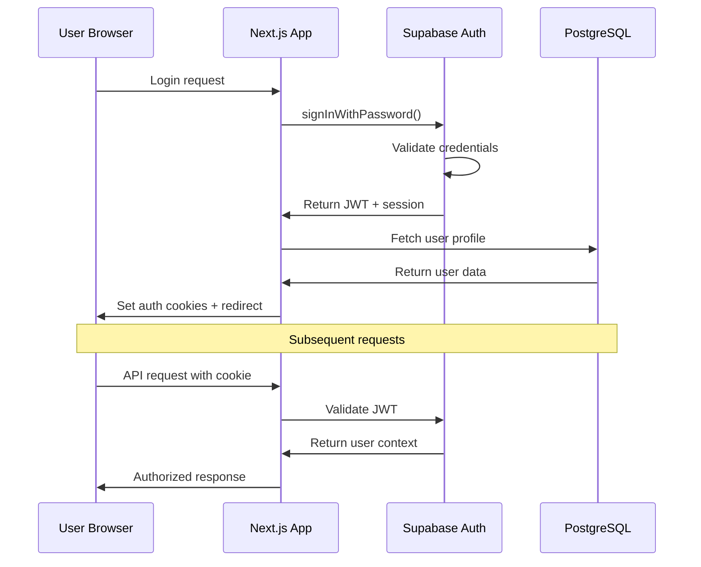

# Backend Architecture

## Service Architecture

### Serverless Architecture (Vercel Edge Functions)

#### Function Organization
```
apps/api/src/
├── functions/           # Vercel Edge Functions
│   ├── ai/             # AI processing functions
│   │   ├── analyze.ts  # Topic analysis
│   │   ├── generate.ts # Content generation
│   │   └── cache.ts    # AI response caching
│   ├── auth/           # Authentication functions
│   ├── projects/       # Project management
│   ├── lessons/        # Lesson operations
│   └── compliance/     # Accessibility validation
├── services/           # Business logic services
├── utils/              # Shared utilities
└── types/              # Shared TypeScript types
```

#### Function Template
```typescript
import { NextRequest, NextResponse } from 'next/server';
import { z } from 'zod';
import { aiService } from '@/services/ai';
import { authMiddleware } from '@/middleware/auth';

const analyzeRequestSchema = z.object({
  topics: z.array(z.string()).min(1).max(10),
  analysisType: z.enum(['clark_mayer', 'bloom_taxonomy']).default('clark_mayer')
});

export const runtime = 'edge';

export default async function handler(req: NextRequest) {
  try {
    // Authentication middleware
    const authResult = await authMiddleware(req);
    if (!authResult.success) {
      return NextResponse.json({ error: 'Unauthorized' }, { status: 401 });
    }

    // Validate request
    const body = await req.json();
    const { topics, analysisType } = analyzeRequestSchema.parse(body);

    // Process AI analysis
    const results = await aiService.batchAnalyzeTopics(
      topics,
      analysisType,
      authResult.user.id
    );

    return NextResponse.json({ data: results });
  } catch (error) {
    console.error('AI analysis error:', error);
    return NextResponse.json(
      { error: 'Analysis failed' },
      { status: 500 }
    );
  }
}
```

## Database Architecture

### Schema Design
The database schema is already defined above in the PostgreSQL section with proper indexing and relationships.

### Data Access Layer
```typescript
import { SupabaseClient } from '@supabase/supabase-js';
import type { Database } from '@/types/database';

export class LessonRepository {
  constructor(private supabase: SupabaseClient<Database>) {}

  async create(lesson: CreateLessonInput): Promise<Lesson> {
    const { data, error } = await this.supabase
      .from('lessons')
      .insert(lesson)
      .select()
      .single();

    if (error) throw new Error(`Failed to create lesson: ${error.message}`);
    return data;
  }

  async findByProjectId(projectId: string): Promise<Lesson[]> {
    const { data, error } = await this.supabase
      .from('lessons')
      .select(`
        *,
        lesson_content(*),
        accessibility_reports(*)
      `)
      .eq('project_id', projectId)
      .order('created_at', { ascending: false });

    if (error) throw new Error(`Failed to fetch lessons: ${error.message}`);
    return data;
  }

  async updateContent(
    lessonId: string,
    content: LessonContentInput
  ): Promise<LessonContent> {
    const { data, error } = await this.supabase
      .from('lesson_content')
      .upsert({
        lesson_id: lessonId,
        ...content,
        updated_at: new Date().toISOString()
      })
      .select()
      .single();

    if (error) throw new Error(`Failed to update content: ${error.message}`);
    return data;
  }
}
```

## Authentication and Authorization

### Auth Flow


### Middleware/Guards
```typescript
import { createMiddlewareClient } from '@supabase/auth-helpers-nextjs';
import { NextRequest, NextResponse } from 'next/server';

export async function authMiddleware(req: NextRequest) {
  const res = NextResponse.next();
  const supabase = createMiddlewareClient({ req, res });

  const {
    data: { session },
    error
  } = await supabase.auth.getSession();

  if (error || !session) {
    return {
      success: false,
      error: 'Authentication required'
    };
  }

  // Fetch user profile with role information
  const { data: user, error: userError } = await supabase
    .from('users')
    .select('*')
    .eq('id', session.user.id)
    .single();

  if (userError || !user) {
    return {
      success: false,
      error: 'User profile not found'
    };
  }

  return {
    success: true,
    user,
    session
  };
}

export function requireRole(role: 'designer' | 'manager' | 'admin') {
  return async (req: NextRequest) => {
    const authResult = await authMiddleware(req);
    
    if (!authResult.success) {
      return authResult;
    }

    if (authResult.user.role !== role) {
      return {
        success: false,
        error: 'Insufficient permissions'
      };
    }

    return authResult;
  };
}
```
