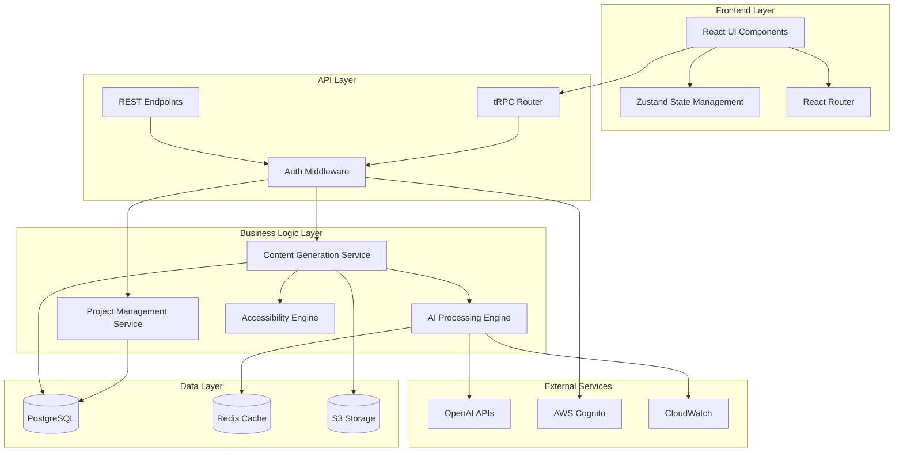

# Components

Based on the architectural patterns, tech stack, and data models, here are the major logical components across the fullstack:

## AI Processing Engine

**Responsibility:** Handles all AI interactions including instructional design framework analysis, content generation, and intelligent model routing for cost optimization with detailed cost tracking and budget controls.

**Key Interfaces:**
- `analyzeContent(content: string, analysisType: string): InstructionalDesignAnalysis`
- `generateLessonContent(lesson: Lesson, options: GenerationOptions): LessonContent`
- `routeToOptimalModel(complexity: string, tokenEstimate: number): ModelChoice`
- `trackCostUsage(userId: string, operation: string, cost: number): CostUsageResult`
- `validateBudgetConstraints(userId: string, estimatedCost: number): BudgetValidationResult`

**Dependencies:** OpenAI GPT-5 API, GPT-3.5 API, Redis Cache, Cost Tracking Service, Budget Alert Service

**Technology Stack:** Node.js/Fastify service, OpenAI SDK, Redis client, custom prompt optimization, real-time cost monitoring

**Cost Control Architecture:**
- **Real-time Cost Tracking:** Every API call logged with token usage and cost calculation
- **Budget Alert System:** Automated alerts at 70%, 85%, and 95% of monthly budget thresholds
- **Model Selection Logic:** Intelligent routing based on complexity analysis and current budget status
- **Cost Capping:** Hard stops prevent exceeding 30% revenue ratio with graceful degradation to cached responses

## Accessibility Compliance Engine

**Responsibility:** Automated WCAG 2.1 validation, violation detection, and compliance reporting for enterprise audit requirements with 90%+ accuracy validation.

**Key Interfaces:**
- `validateContent(content: LessonContent): AccessibilityReport`
- `generateComplianceReport(lessonId: string, format: string): ComplianceDocument`
- `autoFixViolations(violations: AccessibilityViolation[]): FixResult`
- `runComplianceTestSuite(content: LessonContent): TestSuiteResult`
- `validateAccuracyBenchmark(testSet: TestContent[]): AccuracyMetrics`

**Dependencies:** axe-core library, Content Analysis Service, Document Generation Service, Accessibility Test Suite

**Technology Stack:** Node.js service with axe-core, custom WCAG rule engine, PDF generation utilities, automated testing framework

**Compliance Testing Framework:**
- **Automated Pipeline Integration:** axe-core integration in CI/CD with failure conditions for WCAG violations
- **Accuracy Validation System:** Benchmark testing against known compliance datasets to maintain 90%+ accuracy
- **Multi-level Testing:** Real-time validation during content creation + comprehensive audit for final reports
- **Manual Testing Integration:** Workflow for human validation of edge cases and complex accessibility requirements
- **Historical Accuracy Tracking:** Monitor compliance accuracy over time with automated quality improvement feedback loops

## Content Generation Service

**Responsibility:** Orchestrates lesson plan creation, manages generation workflows, and ensures consistency across instructional formats.

**Key Interfaces:**
- `createLessonPlan(topics: Topic[], format: DeliveryFormat): LessonPlan`
- `generateActivities(contentType: string, audience: string): Activity[]`
- `createProfessionalDocumentation(lesson: Lesson): InstructionalDesignChart`

**Dependencies:** AI Processing Engine, Template Engine, Accessibility Engine

**Technology Stack:** Node.js orchestration service, template processing, async job queue

## User Interface Components (React)

**Responsibility:** Professional, accessible frontend interface enabling guided lesson creation and stakeholder presentation views.

**Key Interfaces:**
- Lesson Builder Wizard (step-by-step content creation)
- AI Generation Progress Dashboard
- Accessibility Compliance Monitor
- Stakeholder Sharing Interface

**Dependencies:** tRPC client, Chakra UI components, State Management (Zustand)

**Technology Stack:** React 18, TypeScript, Chakra UI, tRPC React client, Vite bundler

## Project Management Service

**Responsibility:** Handles project lifecycle, collaboration workflows, and enterprise team management features.

**Key Interfaces:**
- `createProject(projectData: ProjectInput): Project`
- `manageCollaborators(projectId: string, collaborators: User[]): CollaborationResult`
- `trackProgress(projectId: string): ProjectStatus`

**Dependencies:** User Management, Notification Service, Audit Logging

**Technology Stack:** Node.js/Fastify service, PostgreSQL, AWS Cognito integration

## Authentication & Authorization Service

**Responsibility:** Enterprise-grade user management, SSO integration, and role-based access control.

**Key Interfaces:**
- `authenticateUser(credentials: LoginInput): AuthResult`
- `validatePermissions(userId: string, resource: string): PermissionResult`
- `manageSSOIntegration(orgId: string): SSOConfig`

**Dependencies:** AWS Cognito, PostgreSQL user store, Enterprise directory services

**Technology Stack:** AWS Cognito, custom RBAC middleware, JWT token management

## Component Diagrams

