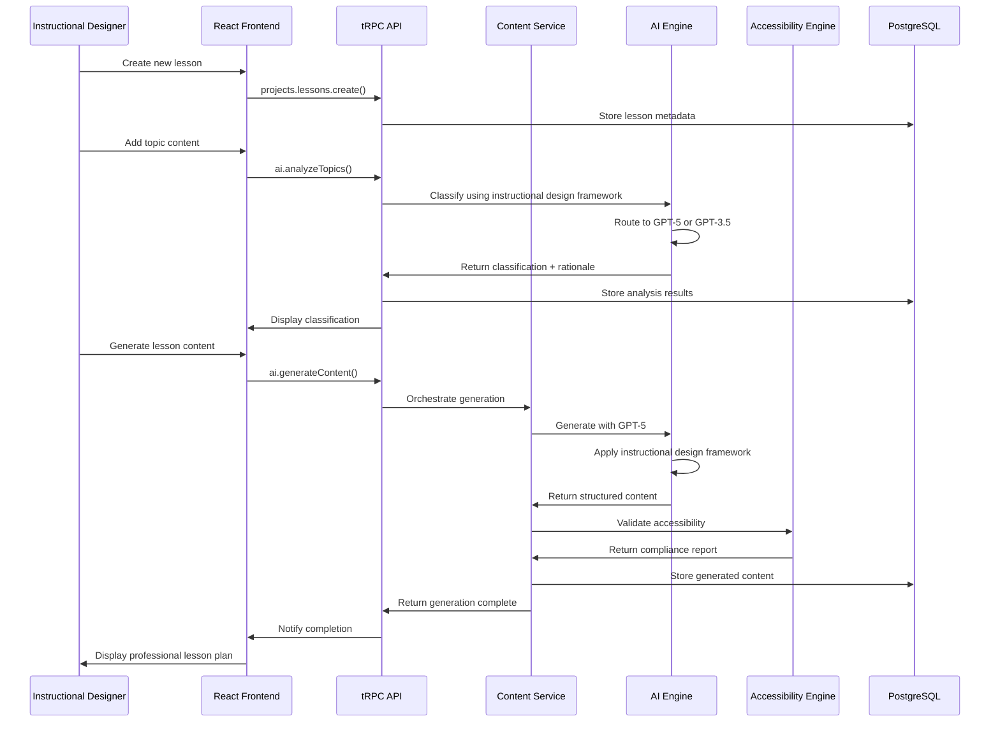
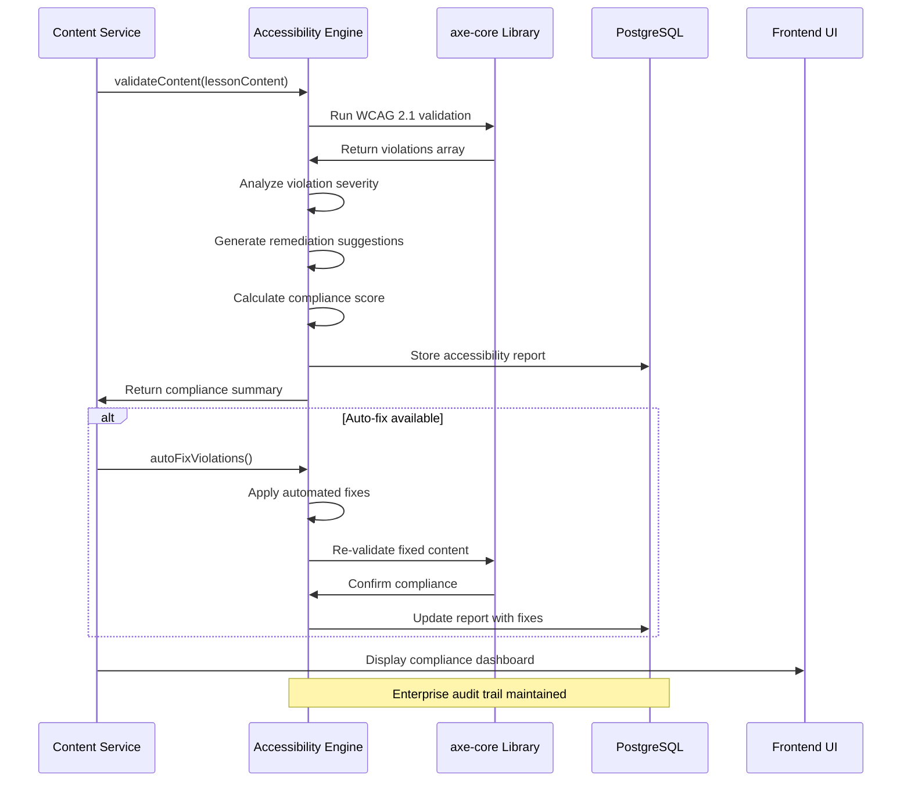

# Core Workflows

## Lesson Generation Workflow

```mermaid
sequenceDiagram
    participant User as Instructional Designer
    participant UI as React Frontend
    participant API as tRPC API
    participant Content as Content Service
    participant AI as AI Engine
    participant Access as Accessibility Engine
    participant DB as PostgreSQL
    
    User->>UI: Create new lesson
    UI->>API: projects.lessons.create()
    API->>DB: Store lesson metadata
    
    User->>UI: Add topic content
    UI->>API: ai.analyzeTopics()
    API->>AI: Classify using instructional design framework
    AI->>AI: Route to GPT-5 or GPT-3.5
    AI->>API: Return classification + rationale
    API->>DB: Store analysis results
    API->>UI: Display classification
    
    User->>UI: Generate lesson content
    UI->>API: ai.generateContent()
    API->>Content: Orchestrate generation
    Content->>AI: Generate with GPT-5
    AI->>AI: Apply instructional design framework
    AI->>Content: Return structured content
    Content->>Access: Validate accessibility
    Access->>Content: Return compliance report
    Content->>DB: Store generated content
    Content->>API: Return generation complete
    API->>UI: Notify completion
    
    UI->>User: Display professional lesson plan
```

## Accessibility Validation Workflow

```mermaid
sequenceDiagram
    participant Content as Content Service
    participant Access as Accessibility Engine
    participant axe as axe-core Library
    participant DB as PostgreSQL
    participant User as Frontend UI
    
    Content->>Access: validateContent(lessonContent)
    Access->>axe: Run WCAG 2.1 validation
    axe->>Access: Return violations array
    
    Access->>Access: Analyze violation severity
    Access->>Access: Generate remediation suggestions
    Access->>Access: Calculate compliance score
    
    Access->>DB: Store accessibility report
    Access->>Content: Return compliance summary
    
    alt Auto-fix available
        Content->>Access: autoFixViolations()
        Access->>Access: Apply automated fixes
        Access->>axe: Re-validate fixed content
        axe->>Access: Confirm compliance
        Access->>DB: Update report with fixes
    end
    
    Content->>User: Display compliance dashboard
    
    Note over Access,DB: Enterprise audit trail maintained
```
