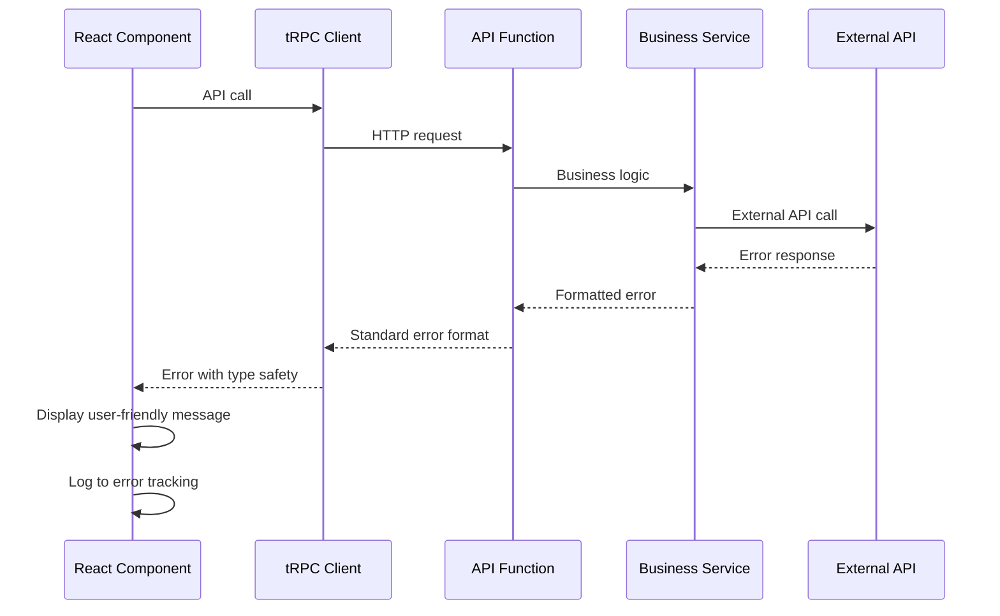

# Error Handling Strategy

## Error Flow


## Error Response Format
```typescript
interface ApiError {
  error: {
    code: string;
    message: string;
    details?: Record<string, any>;
    timestamp: string;
    requestId: string;
  };
}
```

## Frontend Error Handling
```typescript
export function useErrorHandler() {
  const showNotification = useNotificationStore(state => state.show);

  return useCallback((error: unknown) => {
    if (error instanceof TRPCError) {
      // Handle tRPC errors with type safety
      switch (error.code) {
        case 'UNAUTHORIZED':
          showNotification('Please log in to continue', 'error');
          // Redirect to login
          break;
        case 'TOO_MANY_REQUESTS':
          showNotification('Please slow down and try again', 'warning');
          break;
        default:
          showNotification(error.message, 'error');
      }
    } else {
      // Handle unexpected errors
      showNotification('Something went wrong. Please try again.', 'error');
      console.error('Unexpected error:', error);
    }
  }, [showNotification]);
}
```

## Backend Error Handling
```typescript
export class ApiError extends Error {
  constructor(
    public code: string,
    message: string,
    public statusCode: number = 500,
    public details?: Record<string, any>
  ) {
    super(message);
    this.name = 'ApiError';
  }
}

export function errorHandler(error: unknown): NextResponse {
  const requestId = crypto.randomUUID();
  const timestamp = new Date().toISOString();

  if (error instanceof ApiError) {
    return NextResponse.json({
      error: {
        code: error.code,
        message: error.message,
        details: error.details,
        timestamp,
        requestId
      }
    }, { status: error.statusCode });
  }

  // Log unexpected errors
  console.error('Unexpected API error:', error);

  return NextResponse.json({
    error: {
      code: 'INTERNAL_ERROR',
      message: 'An unexpected error occurred',
      timestamp,
      requestId
    }
  }, { status: 500 });
}
```
