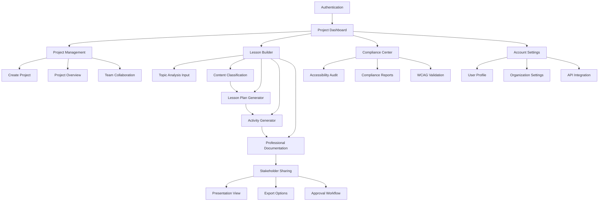
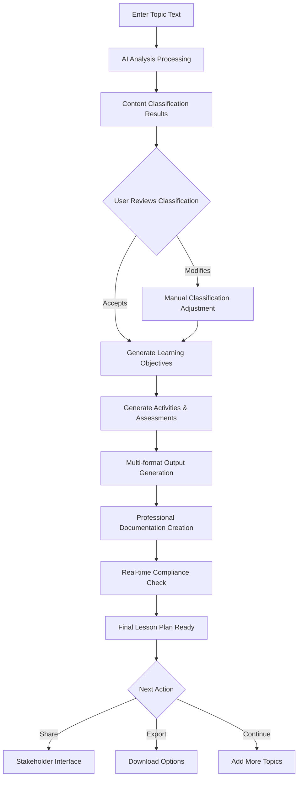

# Instructly UI/UX Specification

## Introduction

This document defines the user experience goals, information architecture, user flows, and visual design specifications for **Instructly's** user interface. It serves as the foundation for visual design and frontend development, ensuring a cohesive and user-centered experience.

### Overall UX Goals & Principles

#### Target User Personas
1. **Corporate Instructional Designers:** Time-pressed professionals needing rapid topic mastery (2-3 week deadlines) who currently waste 40-60% of project time on research
2. **Instructional Design Managers:** Team leads requiring quality assurance, professional standards validation, and stakeholder credibility
3. **Enterprise Compliance Officers:** Need comprehensive accessibility audit documentation and legal compliance verification

#### Usability Goals
- **Professional Credibility:** Interface must position IDs as credible experts rather than "PowerPoint creators"
- **Rapid Value Delivery:** Complete lesson plan generation in under 30 minutes vs. current 4-8 hours
- **Evidence-Based Transparency:** Every AI recommendation includes visible instructional design framework justification
- **Enterprise Accessibility:** 90%+ automated WCAG 2.1 compliance without manual remediation

#### Design Principles
1. **Professional Authority over Consumer Appeal** - Enterprise-grade interface like Tableau/Salesforce rather than creative design tools
2. **Evidence-Based Transparency** - Every decision shows methodology and rationale to build stakeholder credibility  
3. **Guided Workflow Mastery** - Step-by-step wizard approach demonstrates professional methodology while reducing cognitive load
4. **Accessibility by Design** - WCAG AA compliance built into every component as core business requirement
5. **Dashboard-Centric Intelligence** - Central hub with professional metrics suitable for stakeholder presentation

#### Change Log
| Date | Version | Description | Author |
|------|---------|-------------|---------|
| 2025-08-17 | 1.0 | Initial UI/UX specification creation from PRD | Sally (UX Expert) |

## Information Architecture (IA)

### Site Map / Screen Inventory



### Navigation Structure

**Primary Navigation:** Top-level horizontal navigation with Dashboard, Projects, Lesson Builder, Compliance, and Account sections - emphasizing the professional workflow and enterprise requirements

**Secondary Navigation:** Context-sensitive sidebar navigation within each major section, with step-by-step progress indicators in the Lesson Builder for guided workflow approach

**Breadcrumb Strategy:** Full hierarchical breadcrumbs showing Project > Lesson > Current Step for complex workflows, with quick jump-back capability to any previous level

### Progressive Disclosure Strategy

**Core Philosophy:** Start simple for new users, reveal depth for experienced users, maintain expert efficiency

#### Key Disclosure Patterns:

1. **Dashboard Intelligence Layers**
   - Default View: Simple metrics (projects, completion status, recent activity)
   - Progressive Reveals: Click metrics → detailed analytics, hover project cards → quick actions menu
   - Power User Mode: Full BI dashboard with custom widgets and drill-down capabilities

2. **Lesson Builder Complexity Management**
   - Beginner Mode: Step-by-step wizard with single focus per screen
   - Guided Mode: Overview with completed/current/upcoming steps visible
   - Expert Mode: Multi-panel view with parallel editing of objectives, activities, and documentation

3. **Content Classification Presentation**
   - Basic: Simple classification results with confidence scores
   - Detailed: Click to reveal rationale, alternative classifications, methodology explanation
   - Expert: Full framework analysis with customizable weighting and manual override options

4. **Compliance Feature Graduation**
   - Auto Mode: Background compliance checking with simple pass/fail indicators
   - Detailed Mode: Expandable compliance panel showing specific WCAG criteria
   - Audit Mode: Full compliance dashboard with detailed remediation guidance

5. **Stakeholder Interface Sophistication**
   - Simple Share: Clean presentation view with basic commenting
   - Professional Share: Enhanced with methodology documentation and compliance statements
   - Executive Share: High-level summary with business impact metrics

## User Flows

### Topic Analysis to Complete Lesson Plan

**User Goal:** Transform a raw topic into a complete, professional lesson plan with evidence-based instructional design methodology

**Entry Points:** 
- New lesson creation from project dashboard
- "Add Topic" from existing lesson
- Quick-start from main navigation

**Success Criteria:** 
- Complete lesson plan generated in under 30 minutes (vs. current 4-8 hours)
- Research-based content classification with rationale provided
- Both instructor-led and self-paced formats available
- Professional documentation ready for stakeholder presentation

#### Flow Diagram



#### Edge Cases & Error Handling:
- **AI API Failure:** Graceful degradation with manual classification options and cached framework guidance
- **Ambiguous Topic Classification:** Present multiple classifications with confidence scores and allow user selection
- **Compliance Failures:** Show specific WCAG violations with one-click fixes and alternative content suggestions
- **Large Topic Input:** Break down complex topics into smaller, manageable components with guided chunking
- **Insufficient Topic Detail:** Prompt for clarification with framework-specific questions to improve analysis

#### User Emotional Journey:
**Phase 1 - Topic Input (Vulnerability):** Transform "blank page syndrome" anxiety into anticipation through guided input assistance and smart prompts

**Phase 2 - AI Processing (Anticipation/Doubt):** Build confidence through transparent analysis steps ("Analyzing using instructional design methodology...")

**Phase 3 - Classification Results (Make-or-Break):** Turn AI into collaborative partner by showing detailed rationale for evidence-based content classification

**Phase 4 - Learning Objectives (Growing Confidence):** Demonstrate sophisticated understanding through context-aware, SMART objective generation

**Phase 5 - Activities & Assessments (Excitement Building):** Generate genuinely useful, audience-specific activities with practical implementation considerations

**Phase 6 - Professional Documentation (Pride/Validation):** Create methodology explanations that enhance professional credibility with stakeholders

**Phase 7 - Compliance Validation (Relief/Confidence):** Provide enterprise-grade compliance assurance with specific criteria references

**Phase 8 - Final Review (Satisfaction/Amazement):** Reinforce that AI amplified their expertise while maintaining professional quality standards

**Notes:** This flow addresses the core business problem by eliminating "blank page syndrome" while maintaining professional control and building credibility through evidence-based methodology at each step.

## Wireframes & Mockups

### Design System Approach

**Primary Design Inspiration:** Enterprise business intelligence software (Tableau, Salesforce Lightning) that conveys professional authority and sophisticated data handling capabilities

**Core Design Strategy:** Position instructional designers as credible experts through interface design that mirrors established enterprise software patterns while supporting education-specific workflows

### Enterprise Design Authority Patterns

#### **Professional Credibility Elements:**
- **Data Visualization Integration:** Metrics and analytics as first-class interface citizens
- **Sophisticated Toolbars:** Grouped functionality with contextual tool palettes
- **Multi-Panel Layouts:** Side panels for configuration, main workspace, properties panels
- **Evidence-Based Transparency:** Classification rationale and methodology explanations displayed like business model assumptions
- **Dashboard-Centric Intelligence:** Project health, compliance scores, quality indicators presented like business KPIs

#### **Trust-Building Interface Patterns:**
- **Transparent AI Reasoning:** Confidence scores, alternative options, decision rationale prominently displayed
- **User Control Emphasis:** Human oversight and approval visually prominent in all AI interactions
- **Professional Documentation:** Auto-generated materials designed to look hand-crafted by experts
- **Compliance Integration:** Accessibility checking feels built-in rather than bolted-on

### Key Screen Layouts

#### **Project Dashboard**
**Purpose:** Central hub showcasing professional metrics and project intelligence suitable for stakeholder presentation

**Key Elements:**
- Project portfolio overview with health indicators and compliance scores
- Recent activity feed with methodology decisions and quality metrics
- Quick-start options for new lesson creation with guided workflow entry
- Team collaboration status and pending review notifications

**Interaction Notes:** Dashboard widgets are configurable and can be customized for different user roles (individual designer vs. team manager)

**Design File Reference:** Enterprise dashboard layout following Tableau-style information density

#### **Lesson Builder Workspace**
**Purpose:** Guided workflow interface that demonstrates professional methodology while reducing cognitive load

**Key Elements:**
- Step-by-step progress indicator showing methodology phases
- Main content area with contextual toolbars for current workflow step
- Side panel for AI analysis results with expandable rationale sections
- Properties panel for detailed configuration and manual overrides

**Interaction Notes:** Interface adapts from beginner (single focus) to expert (multi-panel) modes based on user preferences and demonstrated competency

**Design File Reference:** Multi-panel workspace layout inspired by Salesforce Lightning App Builder

#### **Content Classification Results**
**Purpose:** Present AI analysis as collaborative expert input rather than automated replacement

**Key Elements:**
- Primary classification recommendation with confidence scoring
- Alternative classification options with rationale explanations
- Methodology framework explanation expandable on demand
- Manual override controls that maintain instructional design principles

**Interaction Notes:** Classification reasoning displayed like financial model assumptions - sophisticated but accessible

**Design File Reference:** Analysis results layout following business intelligence reporting patterns

#### **Stakeholder Sharing Interface**
**Purpose:** Presentation-ready views that enhance professional credibility in client relationships

**Key Elements:**
- Clean, document-style layout optimized for stakeholder review
- Methodology documentation integrated but not overwhelming
- Compliance statements and quality indicators prominently featured
- Comment and approval workflow with electronic signature capabilities

**Interaction Notes:** Interface transitions smoothly from working view to presentation mode without losing functionality

**Design File Reference:** Professional presentation layout suitable for enterprise client meetings

## Component Library / Design System

### Design System Approach

**Strategy:** Custom Enterprise Component Library built upon established design system principles (Salesforce Lightning, Carbon Design System) but optimized for instructional design workflows and stakeholder presentation needs

**Rationale:** Custom components enable optimization for unique AI reasoning display, methodology transparency, compliance integration, and professional credibility requirements while maintaining enterprise-grade consistency and accessibility

### Core Components

#### **AI Interaction Panel**
**Purpose:** Display AI analysis results as collaborative expert input with transparent reasoning

**Variants:** 
- Compact (confidence score + primary recommendation)
- Detailed (full rationale with alternative options)
- Expert (customizable weights with manual override controls)

**States:** Loading, analysis complete, user reviewing, user modified, approved

**Usage Guidelines:** Always show confidence scores prominently; provide clear path to detailed reasoning; maintain user control over final decisions

#### **Methodology Documentation Card**
**Purpose:** Present instructional design decisions and evidence-based rationale in professional format

**Variants:**
- Summary (key decisions with framework references)
- Detailed (full methodology explanation with citations)
- Stakeholder (executive summary suitable for presentations)

**States:** Draft, under review, approved, published

**Usage Guidelines:** Use for building professional credibility; ensure accessibility with proper heading structure; maintain consistent citation format

#### **Compliance Status Indicator**
**Purpose:** Communicate WCAG compliance status with actionable remediation guidance

**Variants:**
- Traffic light (simple pass/warning/fail display)
- Detailed (specific criteria breakdown with scores)
- Audit (comprehensive report suitable for enterprise compliance)

**States:** Checking, compliant, warnings present, violations found, remediated

**Usage Guidelines:** Conservative scoring (over-comply rather than risk); provide specific remediation steps; integrate into workflow rather than separate audit

#### **Professional Dashboard Widget**
**Purpose:** Display project metrics and quality indicators in business intelligence style

**Variants:**
- Metric card (single KPI with trend indicator)
- Chart widget (progress visualization with drill-down)
- Status overview (multi-project health dashboard)

**States:** Loading, current data, stale data, error state

**Usage Guidelines:** Maintain consistency with enterprise dashboard conventions; support both individual and team management views; ensure accessibility with data tables

#### **Guided Workflow Stepper**
**Purpose:** Show methodology progression while supporting different complexity levels

**Variants:**
- Linear (simple step-by-step for beginners)
- Overview (all steps visible with current focus)
- Advanced (parallel workflow with dependencies shown)

**States:** Not started, in progress, completed, requires review, blocked

**Usage Guidelines:** Support progressive disclosure; allow jumping to completed steps; maintain clear visual hierarchy

#### **Stakeholder Review Interface**
**Purpose:** Enable professional presentation and approval workflows

**Variants:**
- Clean view (minimal interface for stakeholder focus)
- Comment mode (annotation and feedback tools)
- Approval mode (signature and decision workflow)

**States:** Under review, commented, changes requested, approved, published

**Usage Guidelines:** Prioritize content over interface; maintain professional aesthetic; support electronic signatures and audit trails

## Branding & Style Guide

### Visual Identity

**Brand Philosophy:** "Professional enough for the boardroom, modern enough for daily use" - combining enterprise trust with contemporary SaaS user experience

**Brand Guidelines:** Custom brand guidelines positioning instructional design as a sophisticated business discipline while maintaining modern SaaS appeal

### Color Palette

| Color Type | Hex Code | Usage |
|------------|----------|--------|
| Primary | #2563EB | Modern professional blue - primary CTAs, headers, key interactive elements |
| Secondary | #64748B | Sophisticated slate gray for structure, secondary text, borders |
| Accent | #10B981 | Success states, compliance indicators, positive feedback and confirmations |
| Success | #10B981 | Positive feedback, confirmations, compliance success |
| Warning | #F59E0B | Cautions, important notices, pending reviews requiring attention |
| Error | #EF4444 | Errors, compliance violations, destructive actions |
| Surface | #F8FAFC | Background and card surfaces with subtle warmth |
| Interactive | #3B82F6 | Hover states, active elements, modern interaction feedback |

### Typography

#### Font Families
- **Primary:** Inter (modern SaaS standard - used by GitHub, Figma, Linear for professional readability)
- **Display:** Manrope (headings with modern geometric feel while remaining professional)
- **Monospace:** JetBrains Mono (technical specifications with contemporary styling)

#### Type Scale
| Element | Size | Weight | Line Height |
|---------|------|--------|-------------|
| H1 | 32px | 600 | 1.25 |
| H2 | 24px | 600 | 1.3 |
| H3 | 20px | 500 | 1.4 |
| Body | 16px | 400 | 1.5 |
| Small | 14px | 400 | 1.4 |

### Iconography
**Icon Library:** Lucide or Phosphor icons (contemporary styling that maintains professional credibility)

**Usage Guidelines:** Icons support meaning without replacing text; consistent 24px sizing; maintain WCAG AA contrast; modern styling that feels approachable yet sophisticated

### Spacing & Layout
**Grid System:** 12-column responsive grid supporting both dashboard widgets and document layouts

**Spacing Scale:** 8px base unit progression (8px, 16px, 24px, 32px, 48px, 64px) for consistent modern spacing

**Modern Enterprise Elements:**
- **Rounded Corners:** 8px border radius for friendly, contemporary feel
- **Subtle Shadows:** Modern elevation with soft, natural shadows (not harsh enterprise borders)
- **Card-Based Layouts:** Clean card designs with proper elevation and spacing
- **Interactive States:** Smooth hover animations and modern loading patterns

### Professional-Modern Balance Strategy

#### **Enterprise Trust Elements:**
- Sophisticated data visualization and comprehensive metrics
- Detailed methodology documentation and audit capabilities
- Conservative color applications in stakeholder-facing materials
- Structured information hierarchy demonstrating analytical rigor

#### **Modern SaaS Appeal Elements:**
- Clean, minimalist interface with generous white space
- Subtle animations and contemporary micro-interactions
- Approachable empty states and friendly onboarding flows
- Intuitive UX patterns familiar from leading SaaS products

**Brand Application:** Interface adapts presentation based on context - professional authority for stakeholder presentations, modern usability for daily workflow tasks

## Accessibility Requirements

### Compliance Target
**Standard:** WCAG 2.1 AA compliance with enterprise-grade verification and audit documentation

**Business Requirement:** 90%+ automated accessibility compliance accuracy without manual remediation, meeting Section 508 requirements for enterprise customers

### Key Requirements

#### **Visual Accessibility:**
- **Color Contrast:** 4.5:1 ratio for normal text, 3:1 for large text (18pt+), with automated validation in real-time
- **Focus Indicators:** High-visibility focus rings with minimum 2px border and sufficient contrast against all backgrounds
- **Text Sizing:** 16px minimum base size with user scalability up to 200% without horizontal scrolling or functionality loss
- **Color Independence:** No information conveyed by color alone; patterns, icons, or text labels supplement color coding

#### **Interaction Accessibility:**
- **Keyboard Navigation:** Complete functionality accessible via keyboard with logical tab order and visible focus management
- **Screen Reader Support:** Semantic HTML structure with comprehensive ARIA labels, landmarks, and live regions for dynamic content
- **Touch Targets:** Minimum 44px tap targets with adequate spacing (8px minimum) for mobile and tablet interfaces
- **Timeout Management:** User control over time limits with warnings and extension options for session timeouts

#### **Content Accessibility:**
- **Alternative Text:** AI-generated alt text for all images with human review and override capabilities
- **Heading Structure:** Logical heading hierarchy (H1-H6) with no skipped levels and descriptive heading text
- **Form Accessibility:** Explicit labels for all form controls with clear error messaging and inline validation
- **Language Declaration:** Proper lang attributes for content in different languages including generated documentation

### Testing Strategy

#### **Automated Testing Integration:**
- **Real-Time Scanning:** axe-core integration for continuous accessibility validation during content creation
- **Build Pipeline Testing:** Automated accessibility testing in CI/CD with failure conditions for WCAG violations
- **Content Generation Testing:** Automated verification that AI-generated content meets accessibility standards

#### **Manual Testing Protocol:**
- **Screen Reader Testing:** Regular testing with NVDA, JAWS, and VoiceOver across different content types
- **Keyboard Navigation Audit:** Complete keyboard-only navigation testing for all user workflows
- **Color Contrast Validation:** Enterprise-grade color contrast tools with batch validation capabilities

#### **User Testing with Assistive Technologies:**
- **Regular User Sessions:** Testing with users who rely on assistive technologies, particularly for AI interaction flows
- **Stakeholder Interface Testing:** Ensure presentation modes maintain full accessibility for stakeholder reviews
- **Mobile Accessibility Testing:** Touch and voice navigation testing on mobile devices and tablets

### Enterprise Compliance Features

#### **Audit Documentation:**
- **Automated Compliance Reports:** Generate Section 508 and WCAG 2.1 conformance statements with detailed evidence
- **Historical Compliance Tracking:** Trend analysis and compliance improvements over time for organizational reporting
- **Legal Review Documentation:** Audit-ready documentation meeting enterprise legal review standards

#### **Organizational Accessibility:**
- **User Preference Management:** Individual accessibility settings that persist across sessions and devices
- **Administrative Controls:** Organization-wide accessibility policy enforcement and reporting capabilities
- **Training Integration:** Accessibility best practices embedded in user onboarding and help documentation

## Responsiveness Strategy

### Breakpoints

| Breakpoint | Min Width | Max Width | Target Devices |
|------------|-----------|-----------|----------------|
| Mobile | 320px | 767px | Smartphones (secondary priority for basic content review) |
| Tablet | 768px | 1023px | iPad/Android tablets (stakeholder presentations and reviews) |
| Desktop | 1024px | 1439px | Laptops and standard desktop monitors (primary workflow) |
| Wide | 1440px | - | Large desktop monitors and external displays (power user setups) |

### Adaptation Patterns

#### **Layout Changes:**
Desktop-first approach with sophisticated multi-panel layouts that collapse gracefully to single-column on smaller screens. Dashboard widgets maintain professional appearance while stacking vertically on tablets. Wide desktop layouts support advanced power user configurations with multiple content areas.

#### **Navigation Changes:**
Primary navigation transforms from horizontal tabs (desktop) to collapsible navigation drawer (tablet/mobile). Secondary navigation becomes slide-out panels with touch-friendly targets. Breadcrumb navigation remains visible but compresses intelligently on smaller screens while maintaining functionality.

#### **Content Priority:**
AI analysis results and methodology explanations remain prominent across all screen sizes. Detailed compliance reports maintain full functionality but may require horizontal scrolling on mobile. Stakeholder presentation mode specifically optimized for tablet viewing with larger touch targets and simplified interface.

#### **Interaction Changes:**
Touch-friendly 44px minimum tap targets on tablet and mobile devices. Hover states gracefully adapt to touch interactions with appropriate feedback. Keyboard shortcuts remain available and functional but may be de-emphasized in mobile interfaces. Drag-and-drop interactions adapt to touch gestures on tablets.

### Device-Specific Optimization

#### **Desktop/Wide (Primary Workflow):**
- Multi-panel layouts with configurable workspace arrangements
- Advanced keyboard shortcuts and power user features prominently available
- Detailed information density suitable for complex lesson planning
- Multiple simultaneous task support with panel management

#### **Tablet (Stakeholder Presentations):**
- Clean, presentation-optimized layouts that enhance professional credibility
- Touch-optimized review and approval workflows
- Simplified navigation that doesn't detract from content focus
- Annotation and commenting tools designed for touch interaction

#### **Mobile (Basic Review):**
- Essential functionality only - project status, basic content review
- Simplified navigation prioritizing most common tasks
- Notification management and basic approval workflows
- Optimized for quick check-ins rather than detailed work

This responsive strategy ensures professional credibility is maintained across all devices while acknowledging the workflow realities of instructional design work and stakeholder presentations.

## Animation & Micro-interactions

### Motion Principles

**Purposeful Movement:** Every animation serves a functional purpose - providing feedback, showing relationships, or guiding attention. No decorative animations that could undermine professional credibility during stakeholder presentations.

**Subtle Professional Polish:** Smooth, refined transitions that feel sophisticated and intentional, similar to high-end business software (Tableau, Figma) rather than consumer apps. Motion enhances the enterprise aesthetic without drawing attention to itself.

**Performance Consciousness:** All animations respect the "prefers-reduced-motion" accessibility setting and degrade gracefully on lower-performance devices. Essential functionality remains available without animation dependencies.

**Contextual Appropriateness:** Motion intensity adapts to context - minimal animations during stakeholder presentation modes, more engaging micro-interactions during daily workflow tasks to enhance usability.

### Key Animations

- **AI Processing Indicator:** Subtle pulse animation with progress indication during content analysis, building confidence in AI processing (Duration: Variable, Easing: ease-in-out)
- **Classification Result Reveal:** Smooth fade-in with slight scale for AI recommendations, emphasizing the collaborative nature of AI suggestions (Duration: 300ms, Easing: ease-out)
- **Panel Transitions:** Slide animations for progressive disclosure and multi-panel layouts, maintaining spatial relationships (Duration: 250ms, Easing: ease-in-out)
- **Success State Confirmations:** Gentle scale and color transition for completed tasks and approvals, reinforcing positive outcomes (Duration: 400ms, Easing: ease-out)
- **Loading State Transitions:** Professional skeleton screen animations and smooth content replacement that maintain layout stability (Duration: 200ms, Easing: ease-in-out)
- **Hover State Feedback:** Subtle scale and shadow changes for interactive elements, providing clear interaction affordances (Duration: 150ms, Easing: ease-out)
- **Dashboard Widget Updates:** Smooth data transitions and chart animations for metric updates, emphasizing data-driven insights (Duration: 500ms, Easing: ease-in-out)
- **Stakeholder Mode Transition:** Clean fade between working and presentation views, maintaining professional focus (Duration: 300ms, Easing: ease-in-out)

### Professional Motion Guidelines

**Enterprise-Appropriate Timing:** All animations use conservative timing that feels deliberate rather than playful. Durations stay within 150-500ms range for optimal perceived performance while maintaining sophistication.

**Consistent Easing:** Primary use of ease-in-out and ease-out curves that feel natural and professional. Avoid bounce or elastic easing that might appear unprofessional in enterprise contexts.

**Reduced Motion Compliance:** All animations have meaningful alternatives for users with motion sensitivity. Essential feedback is communicated through color, text, or icon changes when motion is disabled.

**Cross-Context Adaptation:** Animations automatically reduce in intensity during stakeholder presentation modes and screen sharing scenarios to maintain professional focus on content rather than interface.

## Performance Considerations

### Performance Goals

- **Page Load:** Initial page load under 2 seconds on desktop, under 3 seconds on mobile with 3G connection
- **Interaction Response:** AI analysis results displayed within 3 seconds (per PRD requirement) with immediate feedback
- **Animation FPS:** Maintain 60fps for all animations and interactions, graceful degradation on lower-performance devices

### Design Strategies

#### **AI Response Optimization:**
Implement intelligent caching strategies for AI responses with progressive loading architecture. Show classification confidence scores immediately while detailed rationale loads progressively on demand. Use professional skeleton screens during AI processing to maintain perceived performance while respecting the critical 3-second business requirement.

#### **Progressive Enhancement:**
Core functionality and content load first with advanced features enhanced progressively based on device capabilities and network conditions. Stakeholder presentation modes prioritize content delivery and visual polish over interactive features. Critical workflows (lesson creation, compliance checking) receive priority resource allocation.

#### **Asset Optimization:**
Modern image formats (WebP, AVIF) with responsive loading based on device capabilities and screen size. Component-based code splitting ensures only necessary interface elements are downloaded per user workflow. Font loading optimization with system font fallbacks to prevent layout shifts that could impact professional appearance.

#### **Enterprise Scalability Design:**
Interface architecture designed to support 1000+ concurrent users through efficient component rendering and intelligent data fetching. Dashboard widgets load independently to prevent performance bottlenecks. Real-time features (notifications, collaboration) use efficient WebSocket connections with graceful degradation.

### Performance-UX Integration

#### **Professional Credibility Maintenance:**
Performance optimizations never compromise the professional aesthetic or enterprise credibility. Loading states use sophisticated skeleton screens that maintain layout structure. Error states provide clear, professional messaging with actionable recovery options.

#### **Cost-Performance Balance:**
AI interaction design optimized to maintain <30% revenue cost ratio through intelligent caching, progressive disclosure of detailed analysis, and efficient prompt engineering. Performance improvements directly support business model sustainability.

#### **Cross-Device Performance Strategy:**
Desktop interfaces can support rich, multi-panel layouts with advanced features. Tablet presentation modes optimize for smooth scrolling and touch responsiveness. Mobile interfaces prioritize essential functionality with streamlined performance profiles.

This performance strategy ensures that sophisticated AI capabilities and professional interface polish don't compromise the speed and reliability required for enterprise adoption and daily workflow efficiency.

## Next Steps

### Immediate Actions

1. **Stakeholder Review:** Present UI/UX specification to product stakeholders for validation of professional credibility positioning and enterprise requirements alignment
2. **Design System Validation:** Validate modern SaaS + enterprise professional balance with target users through design concept testing
3. **Technical Architecture Handoff:** Provide detailed specification to Design Architect for frontend architecture planning, emphasizing AI integration and accessibility requirements
4. **Accessibility Consultation:** Engage accessibility specialist to validate WCAG AA compliance strategy and 90% automation accuracy approach
5. **Performance Requirements Verification:** Confirm technical feasibility of 3-second AI response and 1000+ concurrent user performance goals with development team

### Design Handoff Checklist

- [x] All user flows documented with emotional journey mapping
- [x] Component inventory complete with enterprise and modern SaaS variants
- [x] Accessibility requirements defined with WCAG AA compliance strategy
- [x] Responsive strategy clear with device-specific optimization
- [x] Brand guidelines incorporated with professional-modern balance
- [x] Performance goals established aligned with business requirements

### Key Handoff Priorities for Design Architect

1. **AI Integration Architecture:** Prioritize technical implementation of AI interaction components that build trust through transparency and user control
2. **Progressive Disclosure System:** Implement technical architecture supporting complexity management for different user experience levels
3. **Enterprise Accessibility Foundation:** Frontend architecture must support automated WCAG compliance checking from foundational level
4. **Professional Presentation Architecture:** Technical systems supporting seamless transition between working and stakeholder presentation modes
5. **Performance-First Implementation:** Ensure sophisticated features don't compromise the critical 3-second AI response requirement

This comprehensive UI/UX specification provides the foundation for transforming instructional design from "craft-based practice to evidence-based profession" through interface design that enhances professional authority while maintaining modern usability standards.

## AI Frontend Generation Prompts

### Master Context Prompt

For any AI frontend generation tool (v0, Lovable, etc.), use this foundational context:

```
**PROJECT CONTEXT:**
You are building Instructly, an AI-powered instructional design platform that transforms instructional design from craft-based practice to evidence-based profession. The platform helps corporate instructional designers create professional lesson plans with AI assistance, WCAG compliance, and stakeholder-ready documentation.

**TECH STACK:**
- Frontend: React with TypeScript
- Styling: Tailwind CSS
- Icons: Lucide React
- Fonts: Inter (primary), Manrope (headings)
- Design System: Custom enterprise components

**DESIGN PHILOSOPHY:**
"Professional enough for the boardroom, modern enough for daily use" - combining enterprise trust with contemporary SaaS user experience.

**COLOR PALETTE:**
- Primary: #2563EB (modern professional blue)
- Secondary: #64748B (sophisticated slate gray)
- Accent: #10B981 (success/positive states)
- Surface: #F8FAFC (backgrounds with subtle warmth)
- Interactive: #3B82F6 (hover states)

**VISUAL STYLE:**
- 8px border radius for friendly, contemporary feel
- Subtle shadows with soft, natural elevation
- Clean card-based layouts with proper spacing
- 8px base spacing unit (8px, 16px, 24px, 32px, 48px, 64px)
- Professional typography with Inter for body text, Manrope for headings
```

### Key Component Prompts

#### AI Classification Panel
```
**HIGH-LEVEL GOAL:**
Create a professional AI interaction panel component that displays content classification results with transparent reasoning, confidence scores, and user control options.

**DETAILED INSTRUCTIONS:**
1. Create a React TypeScript component named `AIClassificationPanel.tsx`
2. Design a card-based layout with subtle elevation and rounded corners (8px)
3. Include a header section with "Content Classification" title and confidence score badge
4. Display primary classification (Facts/Concepts/Processes/Procedures/Principles) prominently
5. Add expandable "View Reasoning" section with detailed methodology explanation
6. Include alternative classification options with confidence percentages
7. Add manual override controls with "Accept" and "Modify" buttons
8. Use loading state with professional skeleton animation
9. Implement hover states with subtle scaling and shadow changes
10. Ensure all interactive elements meet 44px minimum touch targets

**CODE EXAMPLES & CONSTRAINTS:**
- Use Tailwind CSS classes: `bg-white rounded-lg shadow-sm border border-gray-200`
- Primary button styling: `bg-blue-600 hover:bg-blue-700 text-white px-4 py-2 rounded-md`
- Confidence badge: `bg-green-100 text-green-800 px-2 py-1 rounded-full text-sm font-medium`
- Use Lucide icons: `ChevronDown`, `CheckCircle`, `Edit3`
- Color contrast must meet WCAG AA standards (4.5:1 for normal text)

**STRICT SCOPE:**
Create only the AIClassificationPanel component file. Include proper TypeScript interfaces for props. Do NOT create additional utility files or modify any existing components.
```

#### Professional Dashboard Widget
```
**HIGH-LEVEL GOAL:**
Create a sophisticated dashboard widget component that displays project metrics in business intelligence style, suitable for stakeholder presentations.

**DETAILED INSTRUCTIONS:**
1. Create `DashboardWidget.tsx` with TypeScript interfaces
2. Design flexible widget container supporting different content types (metrics, charts, status)
3. Include widget header with title, optional icon, and "View Details" action
4. Support metric display with large number, label, and trend indicator
5. Add chart placeholder area with proper aspect ratio maintenance
6. Include status indicators with color-coded badges
7. Implement loading states with professional skeleton screens
8. Add hover effects with subtle elevation increase
9. Support responsive behavior - full width on mobile, grid layout on desktop
10. Include export/share functionality with discrete menu trigger

**CODE EXAMPLES & CONSTRAINTS:**
- Widget container: `bg-white rounded-lg shadow-sm border border-gray-200 p-6`
- Metric number: `text-3xl font-semibold text-gray-900`
- Trend indicator: `text-green-600` (positive) or `text-red-600` (negative)
- Status badges: `bg-green-100 text-green-800` for success states
- Animation duration: 150-300ms with ease-out timing

**STRICT SCOPE:**
Create only the DashboardWidget component with supporting TypeScript interfaces. Include proper accessibility attributes (ARIA labels, roles).
```

#### Stakeholder Presentation Interface
```
**HIGH-LEVEL GOAL:**
Create a clean, presentation-optimized interface component that transitions from working view to stakeholder-ready presentation mode.

**DETAILED INSTRUCTIONS:**
1. Create `StakeholderPresentation.tsx` component with mode switching
2. Design clean, minimal layout that prioritizes content over interface elements
3. Include presentation header with lesson title, methodology summary, and compliance status
4. Create content sections with proper typography hierarchy and spacing
5. Add professional footer with generated timestamp and methodology attribution
6. Implement smooth transition animations between working and presentation modes
7. Include comment and approval workflow elements (when in review mode)
8. Add print-friendly styling with proper page breaks
9. Ensure all text meets high contrast requirements for projection/screen sharing
10. Include subtle branding elements that enhance rather than distract

**CODE EXAMPLES & CONSTRAINTS:**
- Presentation layout: `max-w-4xl mx-auto bg-white min-h-screen`
- Typography: Use Manrope for headings, Inter for body text
- Section spacing: `space-y-8` for major sections, `space-y-4` for subsections
- Professional margins: `px-8 py-12` for main content area
- Print styles: `@media print` with `break-inside-avoid` for sections
- Compliance badge: `inline-flex items-center px-3 py-1 rounded-full text-sm font-medium bg-green-100 text-green-800`

**STRICT SCOPE:**
Create only the presentation component with mode switching logic. Include proper semantic HTML structure (main, section, article elements).
```

### Enterprise Design Guidelines for AI Generation

#### Mobile-First Approach:
1. Start with single-column mobile layout (320px-767px)
2. Stack all elements vertically with consistent spacing
3. Use full-width buttons and form elements
4. Then describe tablet adaptations (768px-1023px) with two-column layouts
5. Finally, desktop enhancements (1024px+) with multi-panel configurations

#### Professional Credibility Requirements:
- All loading states must use sophisticated skeleton screens, not spinners
- Error messages should be professional and actionable, never technical jargon
- Success states should feel accomplished, not playful
- Hover effects should be subtle scaling (1.02x max) with soft shadows
- Focus indicators must be highly visible with 2px borders minimum

**Important:** All AI-generated code requires careful human review for accessibility compliance, performance optimization, and integration testing with existing codebase.
